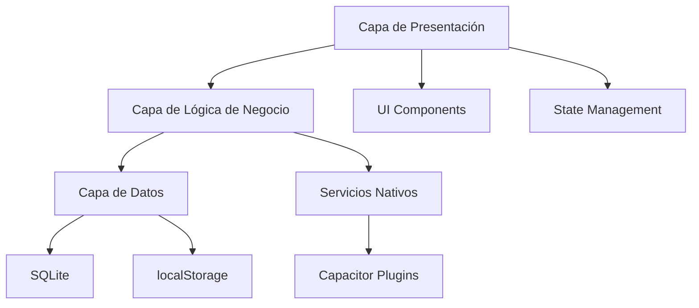
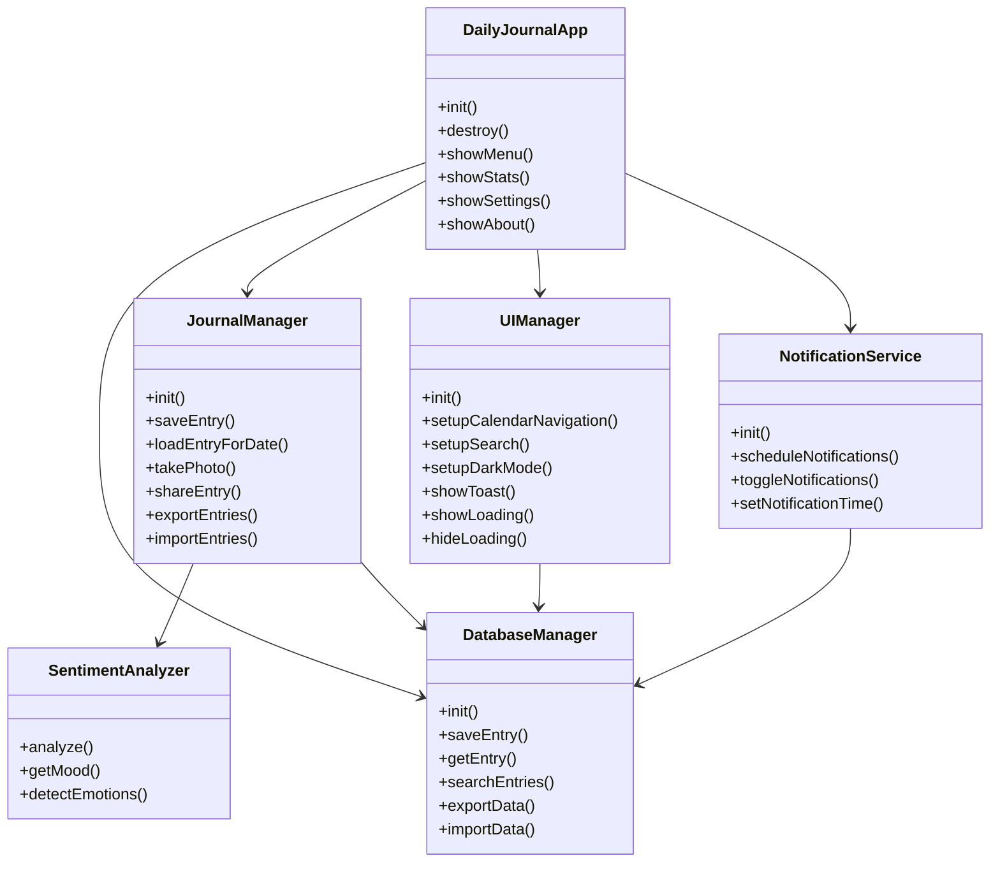
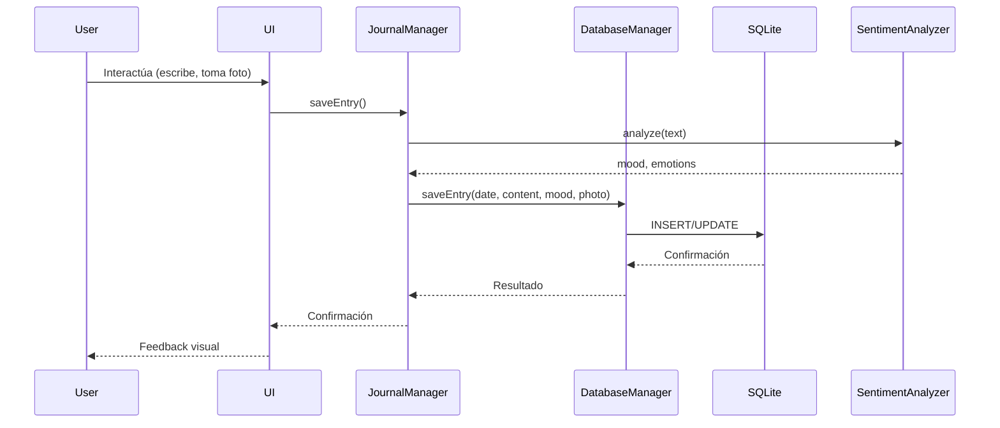
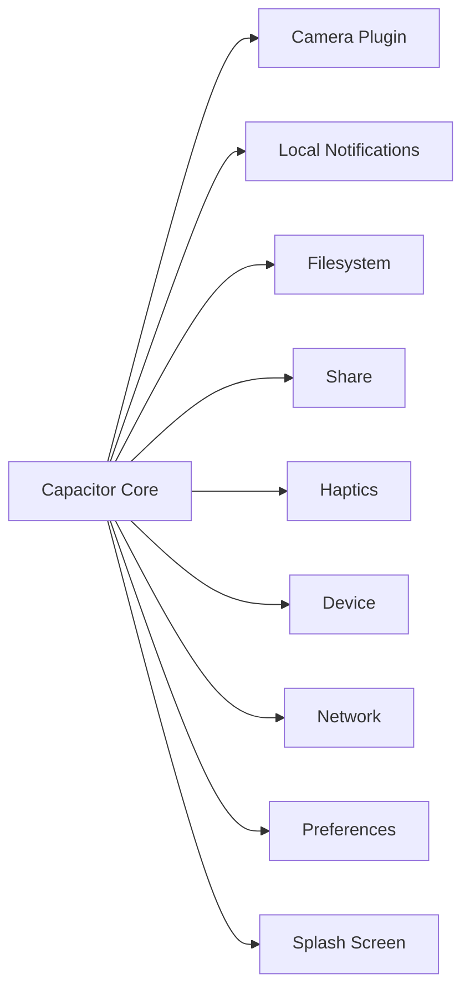
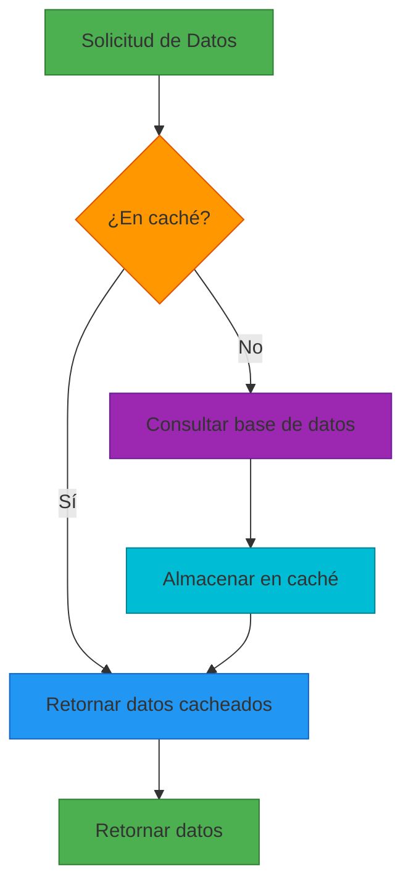

# Arquitectura del Sistema - Daily Journal

## Tabla de Contenidos

- [Arquitectura del Sistema - Daily Journal](#arquitectura-del-sistema---daily-journal)
  - [Tabla de Contenidos](#tabla-de-contenidos)
  - [Visión General](#visión-general)
  - [Arquitectura de Alto Nivel](#arquitectura-de-alto-nivel)
  - [Diagrama de Arquitectura](#diagrama-de-arquitectura)
  - [Capas del Sistema](#capas-del-sistema)
    - [Capa de Presentación](#capa-de-presentación)
    - [Capa de Lógica de Negocio](#capa-de-lógica-de-negocio)
    - [Capa de Datos](#capa-de-datos)
    - [Capa de Servicios](#capa-de-servicios)
  - [Patrones de Diseño](#patrones-de-diseño)
  - [Flujo de Datos Principal](#flujo-de-datos-principal)
  - [Arquitectura de Plugins](#arquitectura-de-plugins)
  - [Estrategia de Persistencia](#estrategia-de-persistencia)
  - [Manejo de Estado](#manejo-de-estado)
  - [Consideraciones de Rendimiento](#consideraciones-de-rendimiento)
  - [Estrategia de Caching](#estrategia-de-caching)
  - [Manejo de Errores](#manejo-de-errores)
  - [Seguridad](#seguridad)
  - [Internacionalización](#internacionalización)
  - [Accesibilidad](#accesibilidad)
  - [Evolución de la Arquitectura](#evolución-de-la-arquitectura)

## Visión General

Daily Journal es una aplicación de diario personal minimalista construida con Capacitor, que permite funcionamiento multiplataforma (Android, iOS y Web/PWA). La arquitectura sigue un enfoque modular y basado en componentes, con separación clara de responsabilidades y un diseño orientado a la escalabilidad.

## Arquitectura de Alto Nivel

La aplicación sigue una arquitectura de **3 capas principales** con componentes especializados:

1. **Capa de Presentación**: Interfaz de usuario y manejo de interacciones
2. **Capa de Lógica de Negocio**: Procesamiento de datos y reglas de negocio
3. **Capa de Datos**: Persistencia y acceso a datos

## Diagrama de Arquitectura

## Capas del Sistema

### Capa de Presentación

**Componentes principales:**
- `UIManager`: Manejo de la interfaz de usuario
- `CalendarManager`: Navegación y visualización del calendario
- `NavigationManager`: Manejo de navegación entre vistas
- `VirtualScrollManager`: Optimización de renderizado para listas grandes

**Tecnologías:**
- HTML5, CSS3, JavaScript Vanilla
- Tailwind CSS para estilos
- Event-driven architecture con listeners

**Responsabilidades:**
- Renderizado de componentes UI
- Manejo de eventos de usuario
- Navegación y routing
- Adaptación a diferentes tamaños de pantalla
- Manejo de temas (light/dark mode)

### Capa de Lógica de Negocio

**Componentes principales:**
- `JournalManager`: Gestión de entradas de diario
- `SentimentAnalyzer`: Análisis de sentimientos
- `NotificationService`: Manejo de notificaciones
- `StateManager`: Gestión de estado global

**Responsabilidades:**
- Procesamiento de datos de entrada
- Validación de datos
- Análisis de texto y detección de emociones
- Gestión de fotos y multimedia
- Coordinación entre componentes
- Manejo de estado de la aplicación

### Capa de Datos

**Componentes principales:**
- `DatabaseManager`: Gestión de base de datos
- `SQLiteConnection`: Conexión a SQLite
- `localStorage`: Almacenamiento web

**Responsabilidades:**
- Persistencia de datos
- Manejo de transacciones
- Migraciones de base de datos
- Sincronización entre plataformas
- Exportación e importación de datos
- Caching de datos

### Capa de Servicios

**Componentes principales:**
- Capacitor Plugins (Camera, Notifications, Filesystem, etc.)
- Servicios nativos (Android/iOS)
- PWA Service Worker

**Responsabilidades:**
- Acceso a hardware del dispositivo
- Manejo de permisos
- Notificaciones locales
- Almacenamiento de archivos
- Funcionalidades específicas de plataforma

## Patrones de Diseño

1. **Singleton**: Para servicios globales como DatabaseManager y JournalManager
2. **Observer**: Para manejo de eventos y notificaciones
3. **Factory**: Para creación de componentes UI
4. **Strategy**: Para diferentes estrategias de persistencia
5. **Facade**: Para simplificar interfaces complejas
6. **Repository**: Para acceso a datos
7. **Command**: Para manejo de acciones de usuario

## Flujo de Datos Principal

## Arquitectura de Plugins

La aplicación utiliza Capacitor para acceder a funcionalidades nativas:

## Estrategia de Persistencia

**Estrategia híbrida:**
- **Plataformas nativas**: SQLite con Capacitor Community SQLite
- **Web/PWA**: localStorage con fallback
- **Sincronización**: Detección automática de plataforma y uso del método apropiado

**Ventajas:**
- Consistencia de datos entre plataformas
- Rendimiento optimizado para cada entorno
- Resistencia a fallos con fallback automático

## Manejo de Estado

**Enfoque:**
- Estado local en componentes
- Estado global mínimo
- Event-driven para comunicación entre componentes
- Cache local para datos frecuentemente accedidos

**Componentes de estado:**
- `StateManager`: Gestión de estado global
- `DatabaseManager.cache`: Caching de entradas y configuraciones
- `JournalManager.state`: Estado del editor actual

## Consideraciones de Rendimiento

1. **Caching**: Implementación de caching en múltiples niveles
2. **Lazy Loading**: Carga diferida de componentes pesados
3. **Debouncing**: Para eventos de entrada de usuario
4. **Virtual Scrolling**: Para listas grandes de entradas
5. **Compresión de imágenes**: Optimización automática de fotos
6. **Minimización de operaciones de BD**: Batch operations y transacciones

## Estrategia de Caching

## Manejo de Errores

**Estrategia:**
- Error boundaries en componentes críticos
- Fallback gracefully para operaciones fallidas
- Logging centralizado
- Notificaciones amigables para el usuario
- Recuperación automática cuando sea posible

**Niveles de manejo de errores:**
1. **Nivel de UI**: Errores de renderizado y visualización
2. **Nivel de negocio**: Errores de procesamiento de datos
3. **Nivel de datos**: Errores de persistencia
4. **Nivel de sistema**: Errores globales y de plataforma

## Seguridad

**Medidas implementadas:**
- Validación de entrada de datos
- Sanitización de contenido
- Protección contra inyección SQL
- Manejo seguro de permisos
- Almacenamiento local seguro
- Protección de datos sensibles

**Consideraciones:**
- Todos los datos son locales (no hay servidor remoto)
- No se requieren autenticación ni autorización
- Los datos son accesibles solo en el dispositivo del usuario

## Internacionalización

**Estrategia actual:**
- Soporte completo para español
- Arquitectura preparada para múltiples idiomas
- Diccionarios de sentimientos en español
- Formatos de fecha y hora localizados

**Futuras mejoras:**
- Sistema de traducción basado en JSON
- Detección automática de idioma
- Soporte para RTL (right-to-left) languages

## Accesibilidad

**Características implementadas:**
- Semántica HTML adecuada
- Navegación por teclado
- Contraste de colores accesible
- Tamaños de fuente adaptables
- Etiquetas ARIA
- Feedback háptico para acciones importantes

## Evolución de la Arquitectura

**Versión Actual (1.0):**
- Arquitectura modular básica
- Soporte multiplataforma con Capacitor
- Persistencia híbrida (SQLite/localStorage)
- Análisis de sentimientos básico

**Futuras mejoras planeadas:**
- Sistema de plugins extensible
- Sincronización en la nube (opcional)
- Arquitectura de microservicios para funcionalidades avanzadas
- Sistema de temas personalizables
- Integración con servicios externos (opcional)