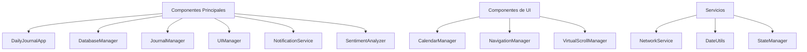
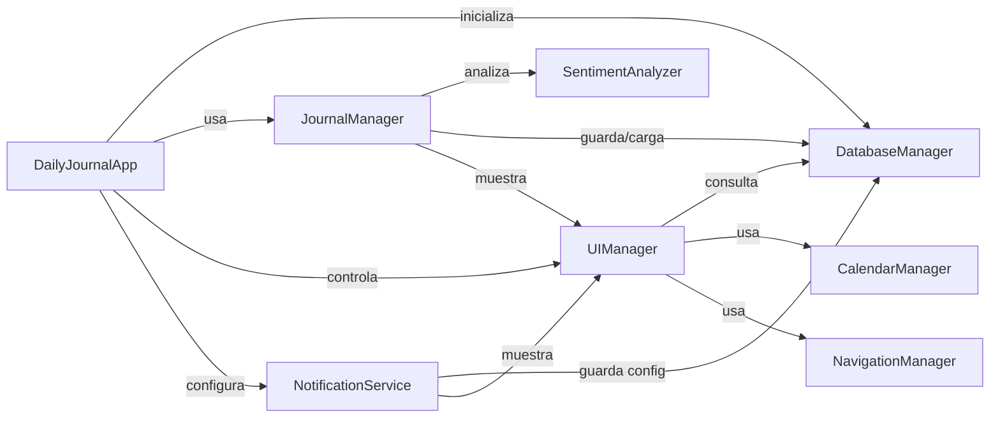
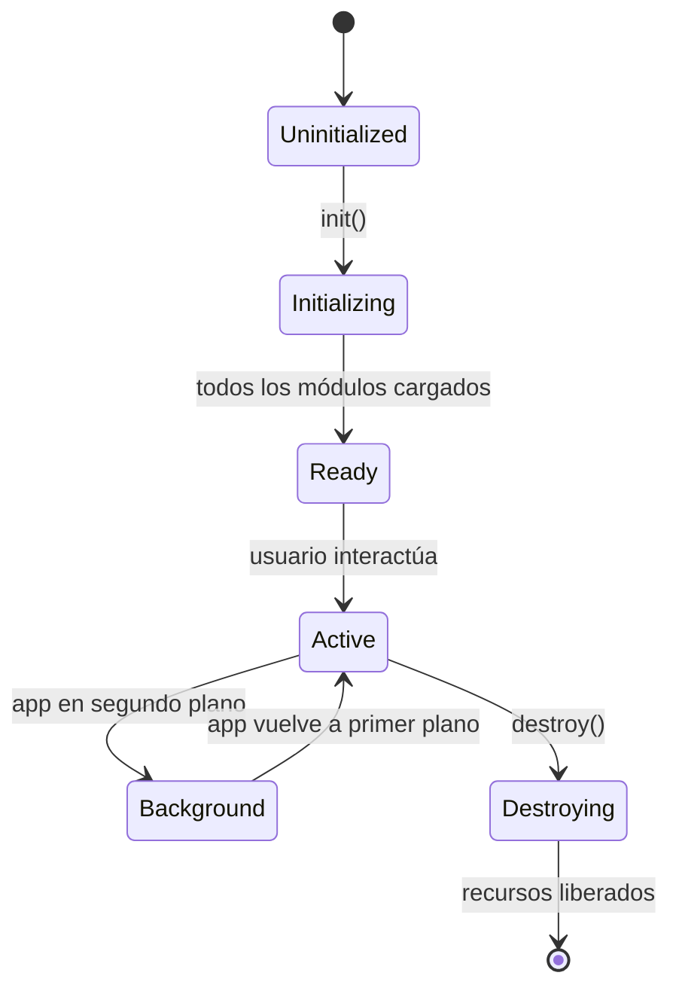

# Componentes del Sistema - Daily Journal

## Tabla de Contenidos

- [Componentes del Sistema - Daily Journal](#componentes-del-sistema---daily-journal)
  - [Tabla de Contenidos](#tabla-de-contenidos)
  - [Visión General](#visión-general)
  - [Estructura de Componentes](#estructura-de-componentes)
  - [Componentes Principales](#componentes-principales)
    - [DailyJournalApp](#dailyjournalapp)
    - [DatabaseManager](#databasemanager)
    - [JournalManager](#journalmanager)
    - [UIManager](#uimanager)
    - [NotificationService](#notificationservice)
    - [SentimentAnalyzer](#sentimentanalyzer)
  - [Componentes de UI](#componentes-de-ui)
    - [CalendarManager](#calendarmanager)
    - [NavigationManager](#navigationmanager)
    - [VirtualScrollManager](#virtualscrollmanager)
  - [Servicios y Utilidades](#servicios-y-utilidades)
    - [NetworkService](#networkservice)
    - [DateUtils](#dateutils)
    - [StateManager](#statemanager)
  - [Diagrama de Componentes](#diagrama-de-componentes)
  - [Relaciones entre Componentes](#relaciones-entre-componentes)
  - [Ciclo de Vida de Componentes](#ciclo-de-vida-de-componentes)
  - [Patrones de Comunicación](#patrones-de-comunicación)
  - [Componentes de Terceros](#componentes-de-terceros)
  - [Estructura de Archivos](#estructura-de-archivos)

## Visión General

Daily Journal está compuesto por una serie de componentes modulares que trabajan juntos para proporcionar una experiencia de diario personal completa. Cada componente tiene responsabilidades bien definidas y se comunica con otros componentes a través de interfaces claras.

## Estructura de Componentes



## Componentes Principales

### DailyJournalApp

**Archivo:** [`www/js/app.js`](www/js/app.js)

**Responsabilidades:**
- Punto de entrada principal de la aplicación
- Inicialización y configuración de todos los módulos
- Manejo del ciclo de vida de la aplicación
- Coordinación entre componentes principales
- Manejo de eventos globales y errores
- Gestión de modales y menús

**Métodos clave:**
- `init()`: Inicializa la aplicación
- `destroy()`: Limpia recursos al cerrar
- `showMenu()`: Muestra el menú principal
- `showStats()`: Muestra estadísticas
- `showSettings()`: Muestra configuraciones
- `showAbout()`: Muestra información de la app

**Dependencias:**
- DatabaseManager
- JournalManager
- UIManager
- NotificationService

### DatabaseManager

**Archivo:** [`www/js/database.js`](www/js/database.js)

**Responsabilidades:**
- Gestión de la base de datos SQLite/localStorage
- Operaciones CRUD para entradas de diario
- Manejo de configuraciones de usuario
- Exportación e importación de datos
- Migraciones de base de datos
- Caching de datos frecuentemente accedidos

**Métodos clave:**
- `init()`: Inicializa la conexión a la base de datos
- `saveEntry(date, content, mood, photoPath, thumbnailPath)`: Guarda una entrada
- `getEntry(date)`: Obtiene una entrada por fecha
- `searchEntries(query, filters)`: Busca entradas
- `exportData()`: Exporta todos los datos
- `importData(data)`: Importa datos
- `getStats()`: Obtiene estadísticas del diario

**Estrategia de persistencia:**
- SQLite para plataformas nativas (Android/iOS)
- localStorage para web/PWA
- Fallback automático si SQLite no está disponible

### JournalManager

**Archivo:** [`www/js/journal.js`](www/js/journal.js)

**Responsabilidades:**
- Gestión de entradas de diario
- Manejo de fotos y multimedia
- Análisis de sentimientos
- Exportación e importación de entradas
- Compartir entradas
- Generación de thumbnails
- Manejo de atajos de teclado

**Métodos clave:**
- `init()`: Inicializa el gestor de diario
- `saveEntry()`: Guarda la entrada actual
- `loadEntryForDate(date)`: Carga una entrada por fecha
- `takePhoto()`: Toma una foto con la cámara
- `shareEntry()`: Comparte la entrada actual
- `exportEntries()`: Exporta entradas a archivo
- `importEntries()`: Importa entradas desde archivo
- `detectAndSetMood(text)`: Detecta el estado de ánimo automáticamente

**Dependencias:**
- DatabaseManager
- SentimentAnalyzer
- Capacitor Camera Plugin
- Capacitor Share Plugin

### UIManager

**Archivo:** [`www/js/ui.js`](www/js/ui.js)

**Responsabilidades:**
- Manejo de la interfaz de usuario
- Navegación entre vistas
- Gestión de temas (light/dark mode)
- Visualización de calendarios
- Búsqueda de entradas
- Notificaciones y feedback visual
- Manejo de modales y diálogos

**Métodos clave:**
- `init()`: Inicializa la UI
- `setupCalendarNavigation()`: Configura la navegación del calendario
- `setupSearch()`: Configura la funcionalidad de búsqueda
- `setupDarkMode()`: Configura el modo oscuro
- `showToast(message, type)`: Muestra notificaciones
- `showLoading()`: Muestra indicador de carga
- `hideLoading()`: Oculta indicador de carga

**Componentes UI:**
- CalendarManager
- NavigationManager
- VirtualScrollManager

### NotificationService

**Archivo:** [`www/js/services/notification-service.js`](www/js/services/notification-service.js)

**Responsabilidades:**
- Gestión de notificaciones locales
- Programación de recordatorios diarios
- Manejo de permisos de notificación
- Generación de frases motivacionales
- Configuración de horarios de notificación

**Métodos clave:**
- `init()`: Inicializa el servicio
- `scheduleNotifications()`: Programa notificaciones diarias
- `toggleNotifications(enabled)`: Activa/desactiva notificaciones
- `setNotificationTime(time)`: Configura la hora de notificación
- `getRandomPhrase()`: Genera frases aleatorias

**Dependencias:**
- Capacitor Local Notifications Plugin
- DatabaseManager (para configuraciones)

### SentimentAnalyzer

**Archivo:** [`www/js/sentiment-analyzer.js`](www/js/sentiment-analyzer.js)

**Responsabilidades:**
- Análisis de sentimientos en texto
- Detección de emociones
- Clasificación de estados de ánimo
- Procesamiento de lenguaje natural básico
- Caching de resultados de análisis

**Métodos clave:**
- `analyze(text)`: Analiza el sentimiento de un texto
- `getMood(text)`: Obtiene el estado de ánimo
- `detectEmotions(text)`: Detecta emociones específicas
- `scoreToEmoji(score)`: Convierte puntuación a emoji

**Técnicas utilizadas:**
- Análisis heurístico basado en palabras clave
- Naive Bayes para clasificación
- Detección de negaciones e intensificadores
- Cálculo de confianza en los resultados

## Componentes de UI

### CalendarManager

**Archivo:** [`www/js/components/CalendarManager.js`](www/js/components/CalendarManager.js)

**Responsabilidades:**
- Visualización del calendario
- Navegación entre meses
- Selección de fechas
- Indicadores visuales de entradas
- Manejo de eventos de calendario

**Características:**
- Vista mensual con indicadores de entradas
- Navegación rápida entre fechas
- Soporte para gestos táctiles
- Optimización para rendimiento

### NavigationManager

**Archivo:** [`www/js/components/NavigationManager.js`](www/js/components/NavigationManager.js)

**Responsabilidades:**
- Manejo de navegación entre vistas
- Historial de navegación
- Transiciones entre pantallas
- Manejo de rutas
- Coordinación con otros componentes

**Características:**
- Navegación basada en eventos
- Soporte para deep linking
- Animaciones suaves
- Manejo de estado de navegación

### VirtualScrollManager

**Archivo:** [`www/js/components/VirtualScrollManager.js`](www/js/components/VirtualScrollManager.js)

**Responsabilidades:**
- Implementación de virtual scrolling
- Optimización de renderizado
- Manejo de listas grandes
- Reciclaje de elementos DOM
- Mejoras de rendimiento

**Características:**
- Soporte para miles de elementos
- Renderizado eficiente
- Manejo de eventos de scroll
- Adaptación a diferentes tamaños de pantalla

## Servicios y Utilidades

### NetworkService

**Archivo:** [`www/js/services/network-service.js`](www/js/services/network-service.js)

**Responsabilidades:**
- Detección de conectividad
- Manejo de estados de red
- Notificaciones de cambios de conectividad
- Optimización para uso offline

**Métodos clave:**
- `init()`: Inicializa el servicio
- `isOnline()`: Verifica si hay conexión
- `onNetworkChange(callback)`: Registra callback para cambios

### DateUtils

**Archivo:** [`www/js/helpers/date-utils.js`](www/js/helpers/date-utils.js)

**Responsabilidades:**
- Manejo y formateo de fechas
- Operaciones con fechas
- Conversión entre formatos
- Utilidades para navegación de calendario

**Métodos clave:**
- `formatDate(date, format)`: Formatea fechas
- `parseDate(dateString)`: Parsea fechas
- `getDateRange(start, end)`: Obtiene rango de fechas
- `isSameDay(date1, date2)`: Compara fechas

### StateManager

**Archivo:** [`www/js/state.js`](www/js/state.js)

**Responsabilidades:**
- Gestión de estado global
- Observación de cambios de estado
- Sincronización entre componentes
- Manejo de estado reactivo

**Características:**
- Estado mínimo y focalizado
- Patrones de observador
- Actualizaciones eficientes
- Soporte para debugging

## Diagrama de Componentes

```mermaid
componentDiagram
    component DailyJournalApp {
        +init()
        +destroy()
        +showMenu()
        +showStats()
    }

    component DatabaseManager {
        +saveEntry()
        +getEntry()
        +searchEntries()
        +exportData()
    }

    component JournalManager {
        +saveEntry()
        +loadEntryForDate()
        +takePhoto()
        +shareEntry()
    }

    component UIManager {
        +setupCalendarNavigation()
        +setupSearch()
        +showToast()
    }

    component NotificationService {
        +scheduleNotifications()
        +toggleNotifications()
    }

    component SentimentAnalyzer {
        +analyze()
        +getMood()
    }

    component CalendarManager {
        +renderCalendar()
        +navigateToDate()
    }

    DailyJournalApp --> DatabaseManager
    DailyJournalApp --> JournalManager
    DailyJournalApp --> UIManager
    DailyJournalApp --> NotificationService
    JournalManager --> SentimentAnalyzer
    JournalManager --> DatabaseManager
    UIManager --> DatabaseManager
    UIManager --> CalendarManager
    NotificationService --> DatabaseManager
```

## Relaciones entre Componentes



## Ciclo de Vida de Componentes



## Patrones de Comunicación

1. **Event-driven**: La mayoría de los componentes se comunican mediante eventos
2. **Callback-based**: Para operaciones asíncronas
3. **Observer pattern**: Para notificaciones de cambios
4. **Direct method calls**: Para operaciones síncronas entre componentes acoplados
5. **Promise-based**: Para manejo de operaciones asíncronas

**Ejemplo de comunicación event-driven:**
```javascript
// Suscripción a eventos
document.addEventListener('entrySaved', (event) => {
    const { date, content } = event.detail;
    // Actualizar UI
});

// Emisión de eventos
document.dispatchEvent(new CustomEvent('entrySaved', {
    detail: { date: '2024-01-01', content: 'Mi entrada' }
}));
```

## Componentes de Terceros

**Capacitor Plugins:**
- `@capacitor/camera`: Para captura de fotos
- `@capacitor/local-notifications`: Para notificaciones locales
- `@capacitor/filesystem`: Para manejo de archivos
- `@capacitor/share`: Para compartir contenido
- `@capacitor/haptics`: Para feedback háptico
- `@capacitor/device`: Para información del dispositivo
- `@capacitor/network`: Para detección de red
- `@capacitor/preferences`: Para configuraciones
- `@capacitor/splash-screen`: Para pantalla de splash
- `@capacitor-community/sqlite`: Para base de datos SQLite

**Otras dependencias:**
- Tailwind CSS: Para estilos
- Vite: Para build y desarrollo
- PostCSS: Para procesamiento de CSS

## Estructura de Archivos

```
www/
├── js/
│   ├── app.js                # DailyJournalApp
│   ├── database.js           # DatabaseManager
│   ├── journal.js            # JournalManager
│   ├── ui.js                 # UIManager
│   ├── sentiment-analyzer.js # SentimentAnalyzer
│   ├── state.js              # StateManager
│   ├── helpers.js            # Utilidades generales
│   ├── components/           # Componentes UI
│   │   ├── CalendarManager.js
│   │   ├── NavigationManager.js
│   │   └── VirtualScrollManager.js
│   ├── services/             # Servicios
│   │   ├── notification-service.js
│   │   └── network-service.js
│   └── helpers/              # Utilidades
│       └── date-utils.js
└── css/
    └── styles.css            # Estilos principales
```

Este documento proporciona una visión completa de todos los componentes que conforman la aplicación Daily Journal, sus responsabilidades, relaciones y cómo interactúan para crear una experiencia de usuario coherente y funcional.