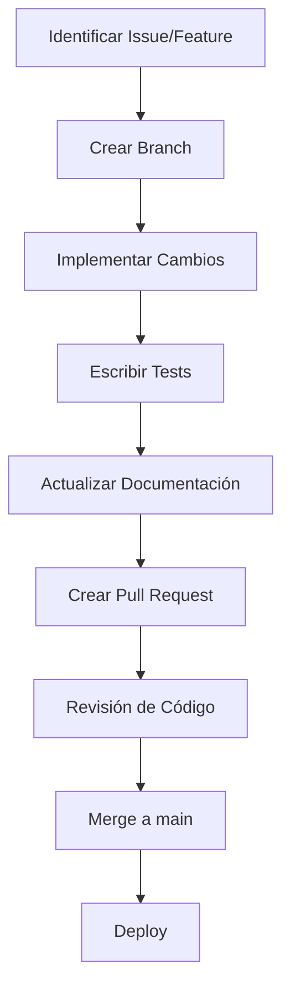
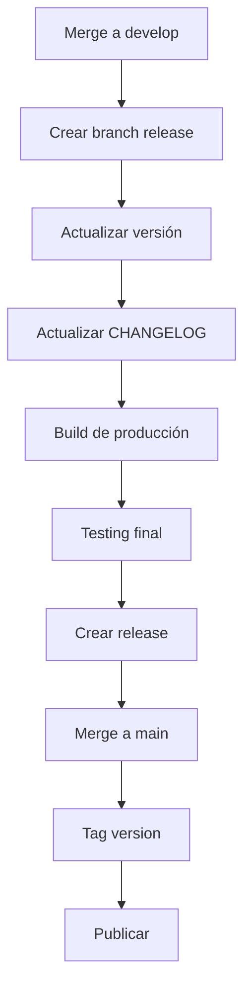

# Guía para Contribuidores - Daily Journal

## Tabla de Contenidos

- [Bienvenido](#bienvenido)
- [Código de Conducta](#código-de-conducta)
- [Cómo Contribuir](#cómo-contribuir)
- [Configuración del Entorno](#configuración-del-entorno)
- [Estructura del Proyecto](#estructura-del-proyecto)
- [Estándares de Código](#estándares-de-código)
- [Proceso de Desarrollo](#proceso-de-desarrollo)
- [Testing](#testing)
- [Documentación](#documentación)
- [Pull Requests](#pull-requests)
- [Revisión de Código](#revisión-de-código)
- [Lanzamiento de Versiones](#lanzamiento-de-versiones)
- [Mantenimiento](#mantenimiento)
- [Reconocimientos](#reconocimientos)
- [Recursos Adicionales](#recursos-adicionales)

## Bienvenido

¡Gracias por tu interés en contribuir a Daily Journal! Este proyecto es de código abierto y apreciamos cualquier contribución, ya sea grande o pequeña.

## Código de Conducta

Al participar en este proyecto, aceptas cumplir con nuestro [Código de Conducta](CODE_OF_CONDUCT.md). Por favor, léelo antes de contribuir.

## Cómo Contribuir

Hay muchas formas de contribuir:

1. **Reportar bugs**: Abrir issues para bugs encontrados
2. **Fixear bugs**: Solucionar issues existentes
3. **Nuevas funcionalidades**: Proponer e implementar nuevas features
4. **Mejoras**: Optimizar código existente
5. **Documentación**: Mejorar la documentación
6. **Traducciones**: Añadir soporte para nuevos idiomas
7. **Tests**: Añadir o mejorar tests
8. **Revisión de código**: Revisar pull requests de otros

## Configuración del Entorno

### Requisitos Previos

- Node.js 18+
- npm 9+
- Git
- Android Studio (para desarrollo Android)
- Xcode (para desarrollo iOS)

### Configuración Inicial

```bash
# Clonar el repositorio
git clone https://github.com/DavidDevGt/JournalCapacitorApp.git
cd JournalCapacitorApp

# Instalar dependencias
npm install

# Configurar plataformas (opcional)
npx cap add android
npx cap add ios
```

### Desarrollo Local

```bash
# Iniciar servidor de desarrollo
npm run dev

# Build para producción
npm run build
```

## Estructura del Proyecto

```
JournalCapacitorApp/
├── android/                  # Proyecto Android nativo
├── ios/                      # Proyecto iOS nativo
├── www/                      # Código de la aplicación web
│   ├── css/                  # Estilos
│   ├── js/                   # JavaScript
│   │   ├── app.js            # Aplicación principal
│   │   ├── database.js       # Gestión de base de datos
│   │   ├── journal.js        # Lógica del diario
│   │   ├── ui.js             # Interfaz de usuario
│   │   ├── sentiment-analyzer.js # Análisis de sentimientos
│   │   ├── components/       # Componentes UI
│   │   ├── services/         # Servicios
│   │   └── helpers/          # Utilidades
│   └── index.html            # Punto de entrada
├── docs/                     # Documentación
├── capacitor.config.json     # Configuración de Capacitor
├── package.json              # Configuración de npm
└── README.md                 # Documentación principal
```

## Estándares de Código

### JavaScript

- Usar ES6+ (ES Modules)
- Preferir `const` sobre `let`
- Usar nombres descriptivos para variables y funciones
- Comentarios JSDoc para funciones públicas
- Evitar efectos secundarios en funciones puras
- Manejo adecuado de errores con try/catch

**Ejemplo:**
```javascript
/**
 * Guarda una entrada de diario
 * @param {string} date - Fecha en formato YYYY-MM-DD
 * @param {string} content - Contenido de la entrada
 * @returns {Promise<{success: boolean, error?: Error}>}
 */
async function saveEntry(date, content) {
    try {
        // Validación
        if (!date || !content) {
            throw new Error('Date and content are required');
        }

        // Lógica de guardado
        const result = await db.saveEntry(date, content);

        return { success: true };
    } catch (error) {
        console.error('Error saving entry:', error);
        return { success: false, error };
    }
}
```

### CSS

- Usar Tailwind CSS para estilos
- Clases semánticas y descriptivas
- Evitar estilos inline
- Usar variables de Tailwind para colores y tamaños
- Mobile-first approach

**Ejemplo:**
```html
<button class="bg-blue-500 hover:bg-blue-600 text-white font-medium py-2 px-4 rounded-lg transition-colors">
    Guardar Entrada
</button>
```

### HTML

- Semántica HTML5
- Atributos ARIA para accesibilidad
- Estructura clara y jerárquica
- Evitar divs innecesarios

**Ejemplo:**
```html
<article class="journal-entry">
    <header class="entry-header">
        <h2 class="entry-date">1 de Enero, 2024</h2>
        <span class="entry-mood" aria-label="Estado de ánimo: Feliz">😊</span>
    </header>
    <div class="entry-content">
        <p>Hoy fue un día maravilloso...</p>
    </div>
    <footer class="entry-footer">
        <span class="word-count">120 palabras</span>
    </footer>
</article>
```

## Proceso de Desarrollo

### Flujo de Trabajo



### Convenciones de Branches

- `main`: Branch principal (solo para releases)
- `develop`: Branch de desarrollo
- `feature/*`: Nuevas funcionalidades
- `fix/*`: Fixes de bugs
- `docs/*`: Cambios en documentación
- `refactor/*`: Refactorización de código
- `test/*`: Añadir o mejorar tests

**Ejemplos:**
```
feature/export-import
fix/notification-bug
docs/api-reference
refactor/database-layer
```

### Convenciones de Commits

Usar [Conventional Commits](https://www.conventionalcommits.org/):

```
<tipo>(<ámbito>): <descripción>
[body opcional]
[footer opcional]
```

**Tipos:**
- `feat`: Nueva funcionalidad
- `fix`: Fix de bug
- `docs`: Cambios en documentación
- `style`: Cambios de formato (sin afectar código)
- `refactor`: Refactorización de código
- `perf`: Mejoras de performance
- `test`: Añadir o corregir tests
- `chore`: Cambios de build o herramientas

**Ejemplos:**
```
feat(journal): add photo management functionality
fix(notifications): correct permission handling on Android 12
docs(api): add reference documentation
refactor(db): improve query performance
chore(deps): update capacitor plugins
```

## Testing

### Tipos de Tests

1. **Unit Tests**: Tests de funciones individuales
2. **Integration Tests**: Tests de integración entre componentes
3. **E2E Tests**: Tests de flujo completo de usuario
4. **Visual Tests**: Tests de regresión visual

### Ejecutar Tests

```bash
# Ejecutar todos los tests
npm test

# Ejecutar tests específicos
npm test -- --testPathPattern=journal
```

### Escribir Tests

**Ejemplo de Unit Test:**
```javascript
import { analyze } from './sentiment-analyzer';

describe('SentimentAnalyzer', () => {
    test('should return neutral for empty text', () => {
        const result = analyze('');
        expect(result.mood).toBe('😐');
        expect(result.score).toBe(0);
    });

    test('should detect positive sentiment', () => {
        const result = analyze('¡Hoy fue un día maravilloso!');
        expect(result.score).toBeGreaterThan(0);
        expect(result.mood).not.toBe('😐');
    });
});
```

## Documentación

### Actualizar Documentación

La documentación debe actualizarse junto con los cambios de código:

1. **API Reference**: Actualizar [`API_REFERENCE.md`](API_REFERENCE.md)
2. **Componentes**: Actualizar [`COMPONENTS.md`](COMPONENTS.md)
3. **Arquitectura**: Actualizar [`ARCHITECTURE.md`](ARCHITECTURE.md) si hay cambios significativos

### Estándares de Documentación

- Usar Markdown para documentación
- Incluir ejemplos de código
- Mantener diagramas actualizados
- Documentar decisiones de diseño
- Explicar "por qué" además de "qué"

## Pull Requests

### Crear un Pull Request

1. **Fork** el repositorio
2. **Crear branch** con nombre descriptivo
3. **Hacer cambios** siguiendo los estándares
4. **Commit** con mensajes claros
5. **Push** a tu fork
6. **Abrir PR** contra el branch `develop`

### Plantilla de Pull Request

```markdown
## Descripción

[Descripción clara de los cambios]

## Tipo de Cambio

- [ ] Bug fix
- [ ] Nueva funcionalidad
- [ ] Cambio de breaking
- [ ] Refactorización
- [ ] Documentación
- [ ] Otros (especificar)

## Checklist

- [ ] He seguido los estándares de código
- [ ] He añadido tests para los cambios
- [ ] He actualizado la documentación
- [ ] He verificado que no hay breaking changes
- [ ] He probado manualmente los cambios
- [ ] He seguido el formato de commits

## Issues Relacionados

[Listar issues relacionados, ej: Fixes #123]

## Capturas de Pantalla (si aplica)

[Adjuntar capturas si hay cambios visuales]
```

### Proceso de Revisión

1. **Asignación**: Un mantenedor será asignado al PR
2. **Revisión**: El mantenedor revisará el código
3. **Comentarios**: Se pueden solicitar cambios
4. **Aprobación**: Una vez aprobado, se mergea
5. **Merge**: El PR se mergea a `develop`

## Revisión de Código

### Checklist de Revisión

- **Funcionalidad**: ¿El código hace lo que debería?
- **Estándares**: ¿Sigue los estándares de código?
- **Tests**: ¿Hay tests adecuados?
- **Documentación**: ¿Está la documentación actualizada?
- **Performance**: ¿Hay problemas de performance?
- **Seguridad**: ¿Hay vulnerabilidades de seguridad?
- **Accesibilidad**: ¿Se siguen las mejores prácticas?
- **Compatibilidad**: ¿Funciona en todas las plataformas?

### Buenas Prácticas

- **Feedback constructivo**: Enfocarse en el código, no en la persona
- **Explicar el "por qué"**: Justificar sugerencias
- **Sugerir mejoras**: Proponer soluciones, no solo señalar problemas
- **Ser específico**: Referenciar líneas de código
- **Reconocer el buen trabajo**: Destacar aspectos positivos

## Lanzamiento de Versiones

### Proceso de Lanzamiento



### Convenciones de Versiones

Usamos [Semantic Versioning](https://semver.org/):

- **MAJOR**: Cambios incompatibles
- **MINOR**: Funcionalidades nuevas compatibles
- **PATCH**: Fixes de bugs compatibles

### Crear una Release

1. Actualizar `package.json` con la nueva versión
2. Actualizar [`CHANGELOG.md`](CHANGELOG.md)
3. Crear tag de Git:
   ```bash
   git tag -a v1.0.0 -m "Release v1.0.0"
   git push origin v1.0.0
   ```
4. Crear release en GitHub

## Mantenimiento

### Responsabilidades de Mantenedores

- Revisar pull requests
- Gestionar issues
- Planificar releases
- Mantener documentación actualizada
- Asegurar calidad del código
- Gestionar la comunidad

### Triaje de Issues

1. **Clasificar**: Bug, feature request, pregunta, etc.
2. **Priorizar**: Alta, media, baja
3. **Etiquetar**: Añadir etiquetas apropiadas
4. **Asignar**: Asignar a mantenedor o contribuidor
5. **Cerrar**: Cerrar issues duplicados o irrelevantes

## Reconocimientos

Agradecemos a todos los contribuidores que han ayudado a mejorar este proyecto:

- [DavidDevGt](https://github.com/DavidDevGt) - Creador y mantenedor principal
- [Contribuidor1](https://github.com/contribuidor1) - Mejoras en UI
- [Contribuidor2](https://github.com/contribuidor2) - Fixes de bugs

## Recursos Adicionales

### Documentación

- [Documentación Oficial](README.md)
- [Arquitectura](ARCHITECTURE.md)
- [API Reference](API_REFERENCE.md)
- [Guía de Setup](SETUP.md)
- [Guía de Despliegue](DEPLOYMENT.md)

### Comunidad

- [GitHub Issues](https://github.com/DavidDevGt/JournalCapacitorApp/issues)
- [GitHub Discussions](https://github.com/DavidDevGt/JournalCapacitorApp/discussions)

### Tecnologías

- [Capacitor Documentation](https://capacitorjs.com/docs)
- [Tailwind CSS Documentation](https://tailwindcss.com/docs)
- [Vite Documentation](https://vitejs.dev/guide/)

Esta guía proporciona todas las instrucciones necesarias para contribuir al proyecto Daily Journal de manera efectiva y siguiendo las mejores prácticas de desarrollo de software.