# Flujos de Datos - Daily Journal

## Tabla de Contenidos

- [Flujos de Datos - Daily Journal](#flujos-de-datos---daily-journal)
  - [Tabla de Contenidos](#tabla-de-contenidos)
  - [Visión General](#visión-general)
  - [Flujo de Datos Principal](#flujo-de-datos-principal)
  - [Flujo de Inicialización](#flujo-de-inicialización)
  - [Flujo de Guardado de Entrada](#flujo-de-guardado-de-entrada)
  - [Flujo de Carga de Entrada](#flujo-de-carga-de-entrada)
  - [Flujo de Análisis de Sentimientos](#flujo-de-análisis-de-sentimientos)
  - [Flujo de Notificaciones](#flujo-de-notificaciones)
  - [Flujo de Exportación/Importación](#flujo-de-exportaciónimportación)
  - [Flujo de Búsqueda](#flujo-de-búsqueda)
  - [Flujo de Gestión de Fotos](#flujo-de-gestión-de-fotos)
  - [Flujo de Configuración](#flujo-de-configuración)
  - [Flujo de Estadísticas](#flujo-de-estadísticas)
  - [Diagramas Mermaid](#diagramas-mermaid)
    - [Diagrama de Flujo de Datos Completo](#diagrama-de-flujo-de-datos-completo)
    - [Diagrama de Secuencia de Inicialización](#diagrama-de-secuencia-de-inicialización)
  - [Patrones de Flujo de Datos](#patrones-de-flujo-de-datos)
  - [Optimizaciones de Flujo](#optimizaciones-de-flujo)
  - [Manejo de Errores en Flujos](#manejo-de-errores-en-flujos)

## Visión General

Este documento describe los principales flujos de datos dentro de la aplicación Daily Journal, mostrando cómo la información circula entre los diferentes componentes y módulos del sistema.

## Flujo de Datos Principal

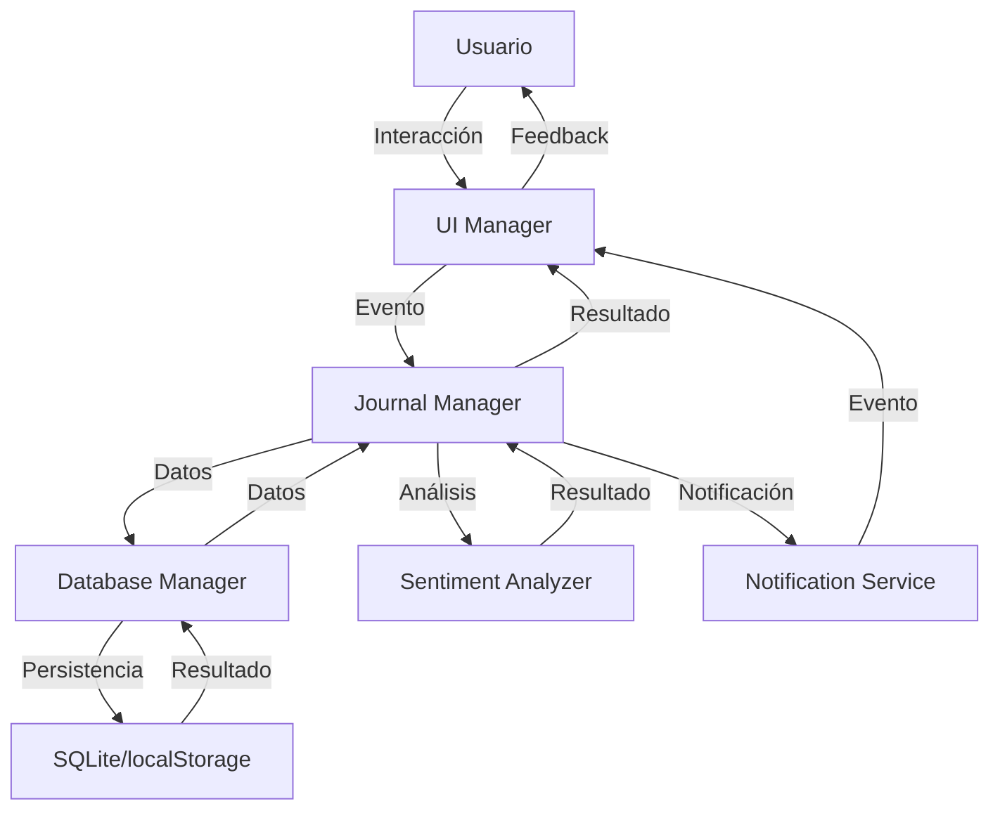

## Flujo de Inicialización

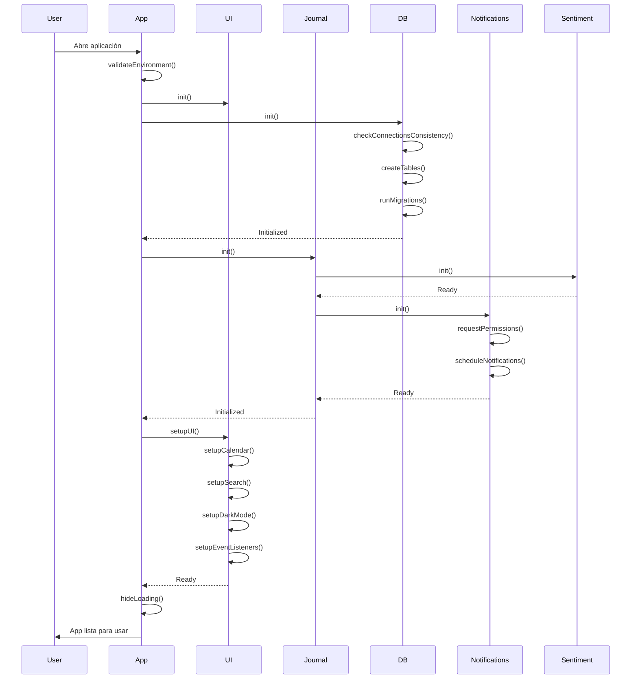

## Flujo de Guardado de Entrada

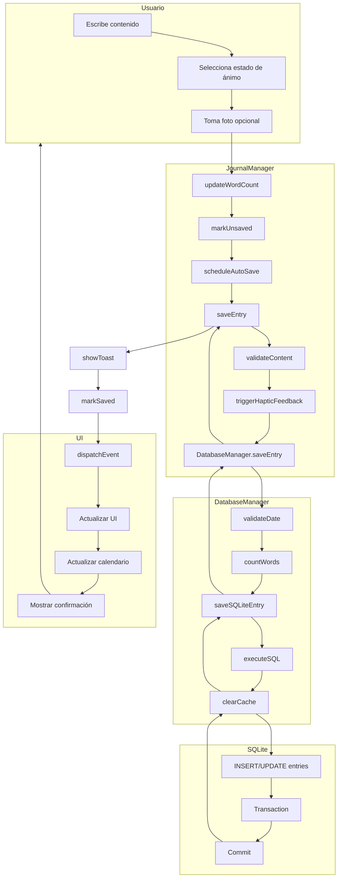

## Flujo de Carga de Entrada

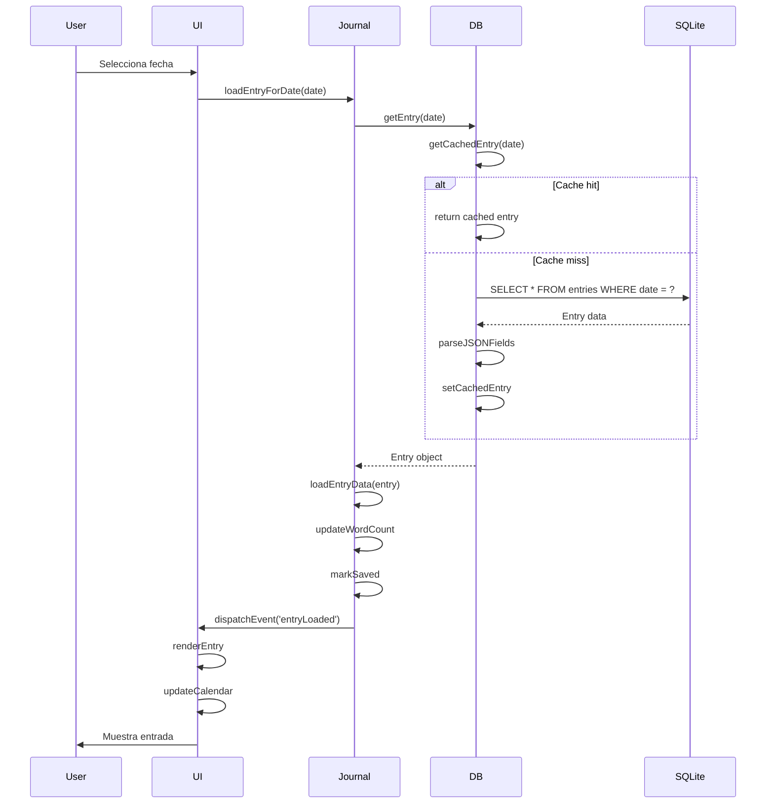

## Flujo de Análisis de Sentimientos

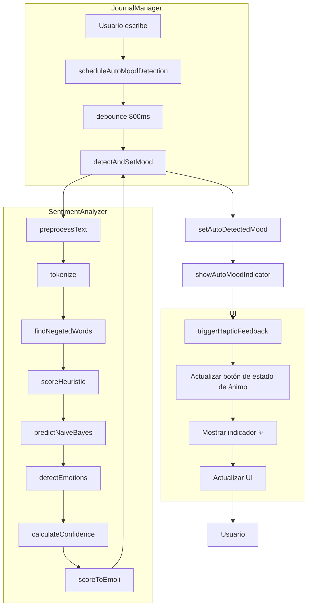

## Flujo de Notificaciones

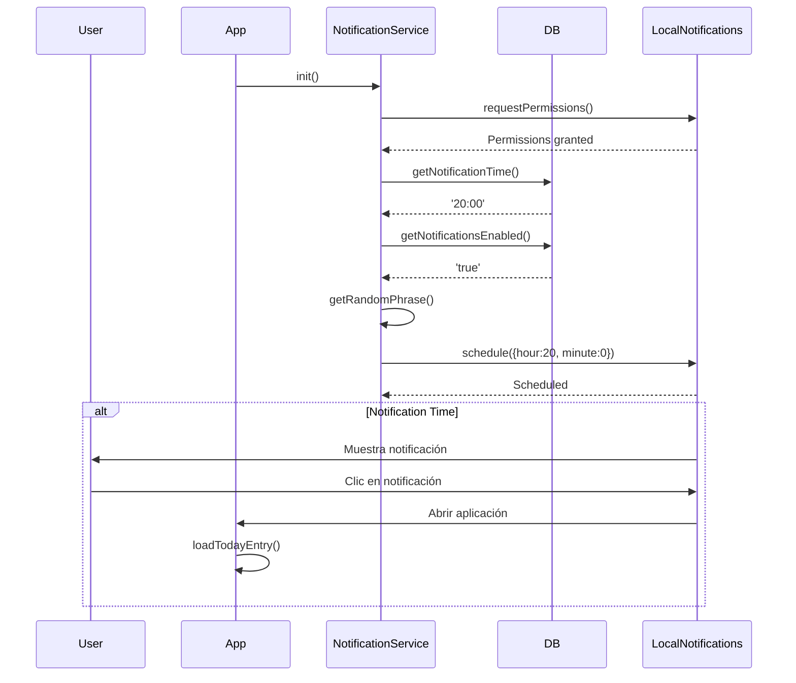

## Flujo de Exportación/Importación

```mermaid
flowchart TD
    subgraph Exportación
        A[Usuario solicita exportar] --> B[showExportConfirmModal]
        B --> C[confirmExport]
        C --> D[exportEntries]
        D --> E[showLoading]
        E --> F[db.exportData]
        F --> G[getAllEntries]
        G --> H[getAllSettings]
        H --> I[createExportObject]
        I --> J[Filesystem.pickDirectory]
        J --> K[Filesystem.writeFile]
        K --> L[showSuccessToast]
        L --> M[hideLoading]
    end

    subgraph Importación
        N[Usuario solicita importar] --> O[showImportModal]
        O --> P[Filesystem.pickFiles]
        P --> Q[validateImportFile]
        Q --> R[processImportData]
        R --> S[db.importData]
        S --> T[validateImportData]
        T --> U[importEntries]
        U --> V[importSettings]
        V --> W[clearCache]
        W --> X[showSuccessToast]
        X --> Y[loadTodayEntry]
    end
```

## Flujo de Búsqueda

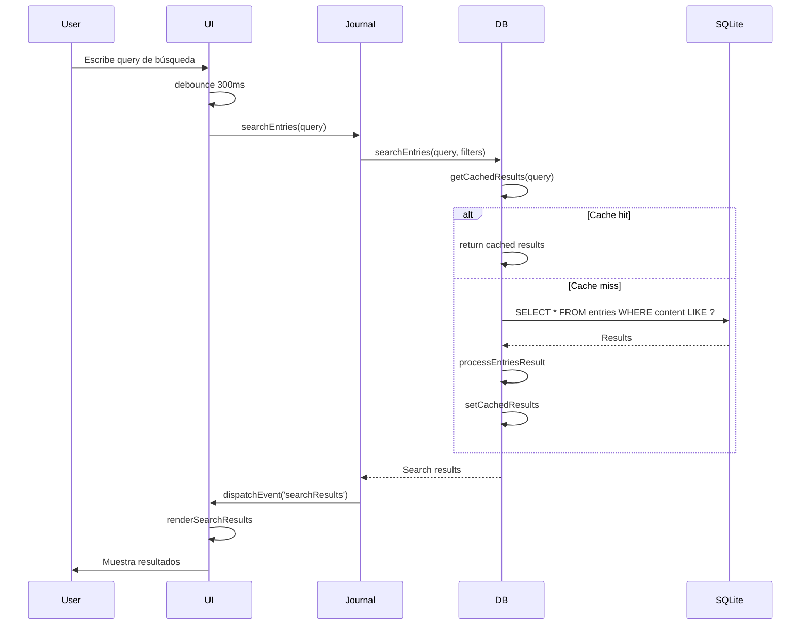

## Flujo de Gestión de Fotos

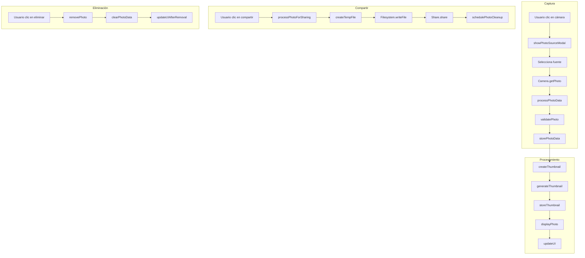

## Flujo de Configuración

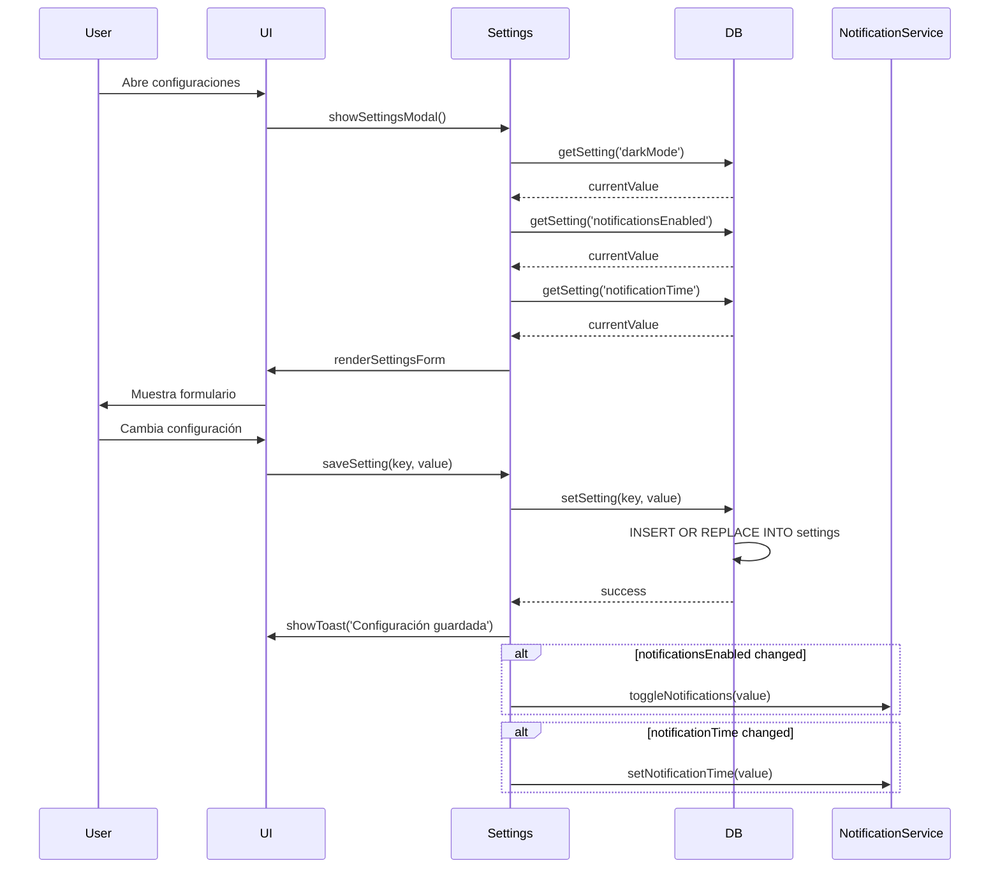

## Flujo de Estadísticas

```mermaid
flowchart TD
    A[Usuario solicita estadísticas (showStats)] --> B(Controller: showStats)

    subgraph Service Layer (Lógica de Negocio)
        B --> C[Service: getWritingStats]
        C --> D[Service: calculateCurrentStreak]
        D --> E[Repo: getEntryDates]
        E --> F(DB: SELECT date FROM entries ORDER BY date DESC)
        F --> D
    end

    subgraph Repository Layer (Acceso a Datos)
        C --> G[Repo: getAggregatedStats]
        G --> H(DB: SELECT COUNT(*) AS totalEntries, SUM(word_count) AS totalWords FROM entries)
    end

    H --> I[totalEntries, totalWords]
    D --> J[currentStreak]

    I --> K[Service: calculateAverage]
    K --> L[avgWordsPerEntry]

    J --> M[Service: createStatsObject]
    L --> M

    M --> N[statsObject]
    N --> O(Controller: generateStatsView)
    O --> P[showStatsModal]
    P --> Q[renderStats]
    Q --> R[Usuario ve estadísticas]
```

## Diagramas Mermaid

### Diagrama de Flujo de Datos Completo

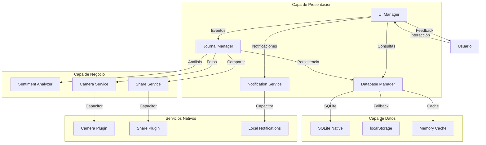

### Diagrama de Secuencia de Inicialización

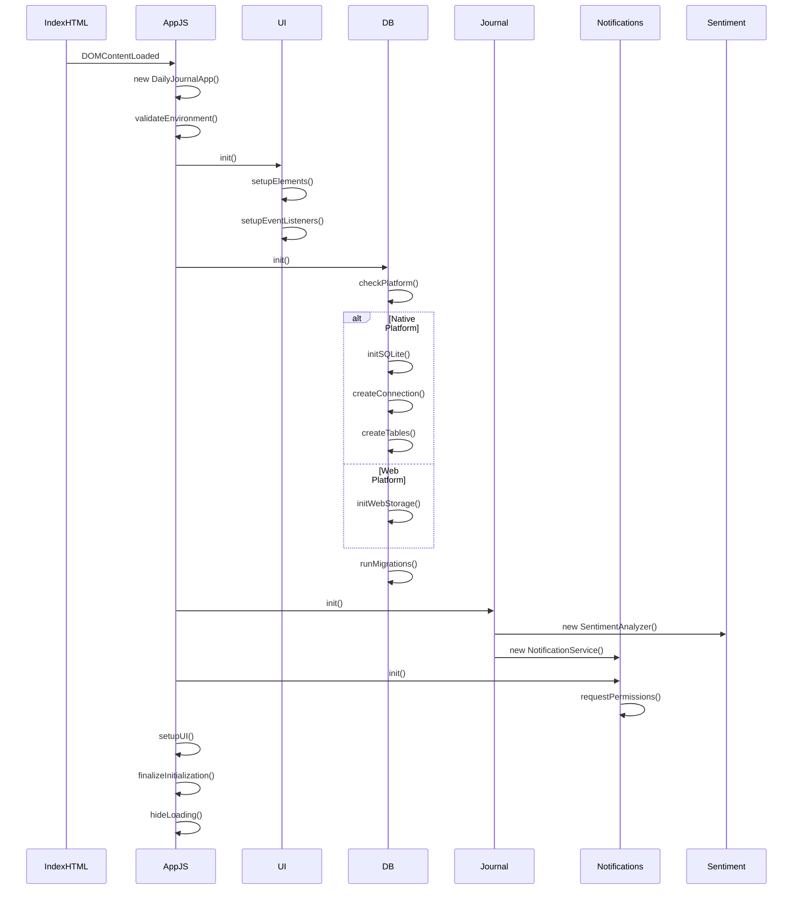

## Patrones de Flujo de Datos

1. **Flujo Unidireccional**: La mayoría de los flujos siguen un patrón unidireccional claro
2. **Event-driven**: Muchos flujos son desencadenados por eventos de usuario
3. **Asincronía**: Operaciones de E/S son asíncronas con callbacks/promises
4. **Caching**: Datos frecuentemente accedidos son cacheados
5. **Fallback**: Múltiples estrategias de fallback para operaciones críticas
6. **Validación**: Validación en múltiples puntos del flujo
7. **Feedback**: Feedback constante al usuario

## Optimizaciones de Flujo

1. **Debouncing**: Para operaciones frecuentes (búsqueda, guardado automático)
2. **Caching**: En múltiples niveles (memoria, localStorage)
3. **Lazy Loading**: Carga diferida de componentes pesados
4. **Batch Operations**: Para operaciones de base de datos
5. **Compresión**: De imágenes y datos
6. **Virtualization**: Para listas grandes
7. **Prefetching**: De datos probablemente necesarios

## Manejo de Errores en Flujos

Cada flujo principal incluye manejo de errores en múltiples puntos:

1. **Validación de entrada**: Antes de procesar datos
2. **Fallback automático**: Cuando una operación falla
3. **Notificación al usuario**: Con mensajes claros
4. **Logging**: Para debugging y análisis
5. **Recuperación**: Intentos de reintento cuando es apropiado
6. **Estado consistente**: Mantener la UI en estado válido

**Ejemplo de manejo de errores en guardado:**
```javascript
try {
    const result = await db.saveEntry(date, content, mood, photo);
    if (!result.success) {
        throw new Error(result.error || 'Unknown error');
    }
    showToast('Guardado exitoso', 'success');
} catch (error) {
    console.error('Save error:', error);
    showToast('Error al guardar', 'error');

    // Fallback: guardar en localStorage
    try {
        localStorage.setItem('backup_entry', JSON.stringify({date, content, mood}));
        showToast('Guardado en backup local', 'warning');
    } catch (backupError) {
        showToast('No se pudo guardar', 'error');
    }
}
```

Este documento proporciona una visión completa de cómo los datos fluyen a través de la aplicación Daily Journal, desde la interacción del usuario hasta la persistencia y viceversa, con diagramas detallados que ilustran cada proceso clave.
