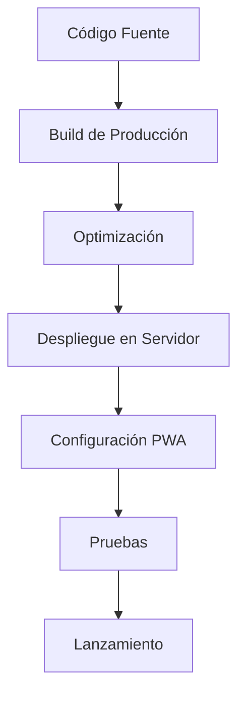
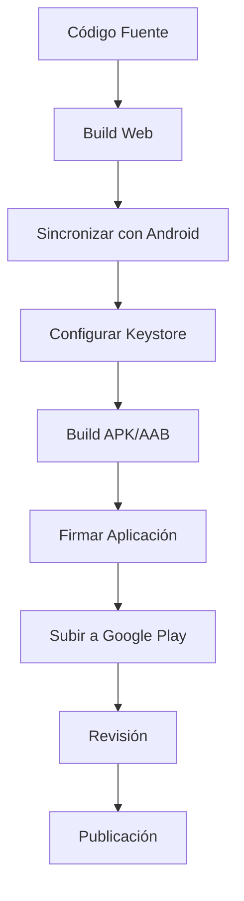
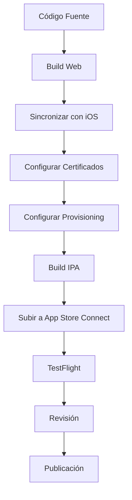
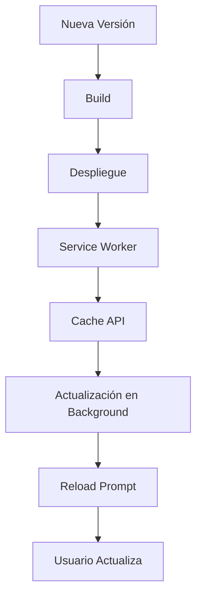
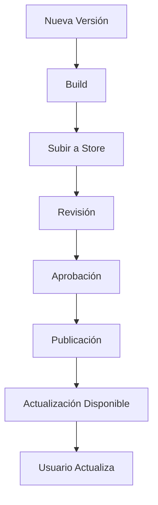
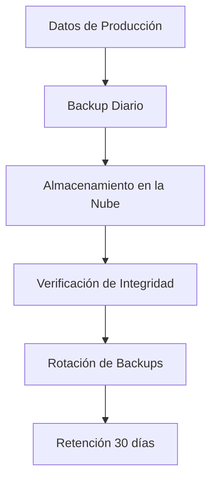
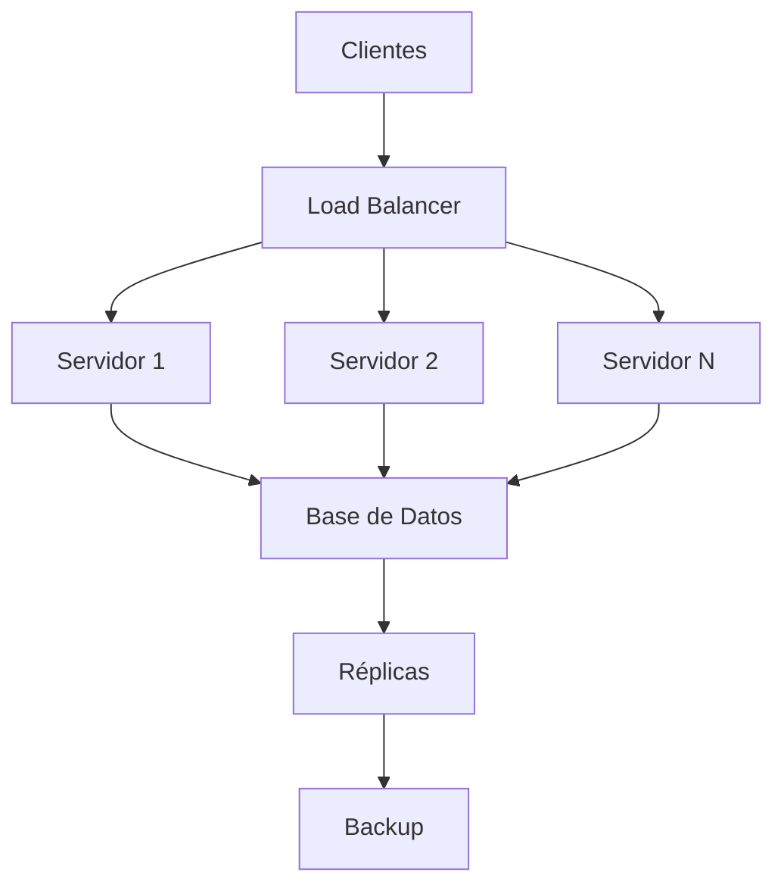
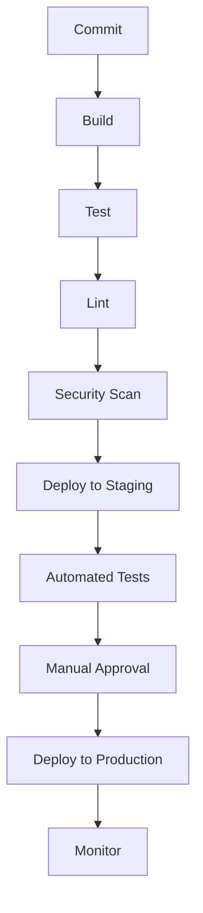

# Guía de Despliegue - Daily Journal

## Tabla de Contenidos

- [Visión General](#visión-general)
- [Despliegue Web/PWA](#despliegue-webpwa)
- [Despliegue Android](#despliegue-android)
- [Despliegue iOS](#despliegue-ios)
- [Configuración de Entorno de Producción](#configuración-de-entorno-de-producción)
- [Optimización para Producción](#optimización-para-producción)
- [Configuración de Servidor](#configuración-de-servidor)
- [Estrategias de Actualización](#estrategias-de-actualización)
- [Monitoreo y Logging](#monitoreo-y-logging)
- [Seguridad en Producción](#seguridad-en-producción)
- [Backup y Recuperación](#backup-y-recuperación)
- [Escalabilidad](#escalabilidad)
- [Configuración de CI/CD](#configuración-de-cicd)
- [Pruebas Pre-Despliegue](#pruebas-pre-despliegue)
- [Rollback y Recuperación](#rollback-y-recuperación)
- [Documentación de Despliegue](#documentación-de-despliegue)

## Visión General

Esta guía proporciona instrucciones detalladas para desplegar la aplicación Daily Journal en diferentes plataformas: Web/PWA, Android e iOS. Cada plataforma tiene requisitos y procesos específicos que se detallan a continuación.

## Despliegue Web/PWA

### Requisitos

- Servidor web (Nginx, Apache, etc.)
- Dominio configurado (opcional pero recomendado)
- Certificado SSL (recomendado para PWA)
- Node.js para build

### Proceso de Despliegue



### Build de Producción

```bash
# Build optimizado para producción
npm run build

# Esto genera los archivos en la carpeta 'dist/'
```

### Configuración del Servidor

**Nginx (ejemplo de configuración):**

```nginx
server {
    listen 80;
    server_name journal.example.com;
    root /var/www/journal/dist;
    index index.html;

    location / {
        try_files $uri $uri/ /index.html;
    }

    # Configuración para PWA
    location ~* \.(json|manifest|png|ico)$ {
        expires 1y;
        add_header Cache-Control "public, max-age=31536000, immutable";
    }

    # Redirección HTTPS
    if ($scheme != "https") {
        return 301 https://$host$request_uri;
    }
}
```

### Configuración HTTPS

```bash
# Usar Certbot para obtener certificado SSL
sudo apt-get install certbot
sudo certbot --nginx -d journal.example.com

# Configurar renovación automática
sudo certbot renew --dry-run
```

### Verificación PWA

1. Abrir la URL en Chrome
2. Abrir DevTools (F12)
3. Ir a la pestaña "Application" -> "Manifest"
4. Verificar que el manifest se cargue correctamente
5. Probar la instalación como PWA

## Despliegue Android

### Requisitos

- Android Studio instalado
- Java JDK 17
- Cuenta de Google Play Developer ($25 USD)
- Keystore para firmar la aplicación

### Proceso de Build



### Configuración de Keystore

La aplicación ya tiene configurado un keystore en `android/app/release-key.keystore`. Si necesitas generar uno nuevo:

```bash
# Generar keystore (solo la primera vez)
keytool -genkey -v -keystore android/app/release-key.keystore \
  -alias journal-app-key \
  -keyalg RSA \
  -keysize 2048 \
  -validity 10000
```

### Configuración de Firma

La configuración de firma se maneja a través del archivo `android/signing.properties`

### Configuración de Gradle

El archivo `android/app/build.gradle` ya está configurado para usar automáticamente las propiedades de firma si el archivo `signing.properties` existe:

```groovy
def signingPropertiesFile = file("../signing.properties")

if (signingPropertiesFile.exists()) {
    def signingProperties = new Properties()
    signingProperties.load(new FileInputStream(signingPropertiesFile))

    signingConfigs {
        release {
            storeFile file(signingProperties['storeFile'])
            storePassword signingProperties['storePassword']
            keyAlias signingProperties['keyAlias']
            keyPassword signingProperties['keyPassword']
        }
    }
}

buildTypes {
    release {
        if (signingPropertiesFile.exists()) {
            signingConfig signingConfigs.release
        }
        minifyEnabled false
        proguardFiles getDefaultProguardFile('proguard-android.txt'), 'proguard-rules.pro'
    }
}
```

### Build de Producción

```bash
# Build APK (utiliza Gradle directamente para garantizar la correcta lectura de credenciales de firma)
npm run build:android

# O build AAB (recomendado para Google Play)
cd android && ./gradlew bundleRelease

# El APK/AAB se generará en:
# android/app/build/outputs/apk/release/app-release.apk
# android/app/build/outputs/bundle/release/app-release.aab
```

**Nota importante sobre el proceso de build:**

El script `npm run build:android` ahora utiliza directamente Gradle para la construcción (`cd android && .\\gradlew.bat assembleRelease`), lo que garantiza que las credenciales de firma se lean correctamente desde el archivo `android/signing.properties`. Este cambio resuelve problemas comunes con la lectura de credenciales en entornos CI/CD y garantiza una construcción más confiable.

Si necesitas construir manualmente con Gradle:
```bash
# Build de release (producción)
cd android && .\\gradlew.bat assembleRelease

# Build de debug (desarrollo)
cd android && .\\gradlew.bat assembleDebug
```

Asegúrate de que el archivo `android/signing.properties` esté correctamente configurado con tus credenciales de firma antes de ejecutar builds de release. El archivo debe contener las siguientes propiedades:
```
storeFile=../app/release-key.keystore
storePassword=tu_contraseña
keyAlias=journal-app-key
keyPassword=tu_contraseña
```

Para entornos CI/CD, puedes configurar estas propiedades como variables de entorno o secretos del pipeline.

### Subida a Google Play Console

1. Crear una nueva aplicación en Google Play Console
2. Configurar información de la tienda
3. Subir el bundle (.aab) en la sección "Production"
4. Completar la información requerida (capturas, descripción, etc.)
5. Enviar para revisión
6. Esperar aprobación (1-3 días)
7. Publicar cuando esté aprobado

## Despliegue iOS

### Requisitos

- macOS con Xcode
- Cuenta de Apple Developer ($99 USD/año)
- Certificados de distribución
- Dispositivo iOS para testing (opcional)

### Proceso de Build



### Configuración de Certificados

1. Abrir Xcode
2. Ir a Preferences -> Accounts
3. Añadir cuenta de Apple Developer
4. Configurar los certificados necesarios:
   - Apple Development
   - Apple Distribution
   - Push Notifications (si se usan)

### Configuración de Provisioning Profiles

1. Crear App ID en Apple Developer Portal
2. Crear Provisioning Profile para Development y Distribution
3. Descargar e instalar los profiles en Xcode

### Configuración en Xcode

1. Abrir el proyecto en `ios/App/App.xcodeproj`
2. Seleccionar el target "App"
3. Configurar:
   - Bundle Identifier (debe coincidir con el App ID)
   - Team
   - Signing Certificate
   - Provisioning Profile

### Build de Producción

```bash
# Build para iOS
npm run build:ios

# Abrir Xcode para build final
npm run open:ios
```

En Xcode:
1. Seleccionar "Generic iOS Device" como destino
2. Ir a Product -> Archive
3. Esperar a que complete el proceso de archivado
4. Click en "Distribute App"
5. Seleccionar "App Store Connect"
6. Subir el build

### Subida a App Store Connect

1. Iniciar sesión en App Store Connect
2. Seleccionar la app
3. Completar toda la información requerida
4. Subir capturas de pantalla para diferentes dispositivos
5. Configurar precios y disponibilidad
6. Enviar para revisión
7. Esperar aprobación (1-3 días)
8. Publicar cuando esté aprobado

## Configuración de Entorno de Producción

### Variables de Entorno

Configurar variables de producción en `.env.production`:

```
VITE_APP_VERSION=1.0.0
VITE_DEBUG_MODE=false
VITE_API_TIMEOUT=10000
VITE_SENTRY_DSN=your_sentry_dsn  # Si usa Sentry
```

### Configuración de Logging

```javascript
// Configuración de logging para producción
if (import.meta.env.PROD) {
    console.log = () => {}; // Deshabilitar logs en producción
    console.error = (error) => {
        // Enviar a servicio de logging como Sentry
        if (window.Sentry) {
            Sentry.captureException(error);
        }
    };
}
```

## Optimización para Producción

### Optimización de Build

```javascript
// vite.config.js - Configuración de producción
export default defineConfig({
  build: {
    minify: 'terser',
    terserOptions: {
      compress: {
        drop_console: true,      // Eliminar console.log
        drop_debugger: true,     // Eliminar debugger
        pure_funcs: ['console.log'] // Eliminar llamadas a console.log
      },
      output: {
        comments: false         // Eliminar comentarios
      }
    },
    rollupOptions: {
      output: {
        manualChunks: {
          vendor: ['@capacitor/core', 'sqlite'] // Optimizar chunks
        }
      }
    }
  }
});
```

### Optimización de Imágenes

```bash
# Usar herramientas como ImageMagick para optimizar imágenes
convert icon.png -resize 192x192 -quality 85 icon-192.png
convert icon.png -resize 512x512 -quality 85 icon-512.png
```

### Compresión de Recursos

```bash
# Comprimir archivos estáticos
gzip -9 -c dist/index.html > dist/index.html.gz
gzip -9 -c dist/css/styles.css > dist/css/styles.css.gz
```

## Configuración de Servidor

### Configuración de Cache

```nginx
# Configuración de cache para recursos estáticos
location ~* \.(js|css|png|jpg|jpeg|gif|ico|svg|woff2)$ {
    expires 1y;
    add_header Cache-Control "public, max-age=31536000, immutable";
    add_header Vary Accept-Encoding;
    gzip_static on;
}
```

### Configuración de Seguridad

```nginx
# Headers de seguridad
add_header X-Frame-Options "SAMEORIGIN";
add_header X-Content-Type-Options "nosniff";
add_header X-XSS-Protection "1; mode=block";
add_header Referrer-Policy "strict-origin-when-cross-origin";
add_header Content-Security-Policy "default-src 'self'; script-src 'self' 'unsafe-inline' 'unsafe-eval'; style-src 'self' 'unsafe-inline'; img-src 'self' data:; font-src 'self'; connect-src 'self';";
```

## Estrategias de Actualización

### Actualización Web/PWA



### Actualización Móvil



## Monitoreo y Logging

### Configuración de Sentry

```javascript
// Configuración de Sentry para error tracking
import * as Sentry from '@sentry/browser';

Sentry.init({
  dsn: import.meta.env.VITE_SENTRY_DSN,
  environment: import.meta.env.PROD ? 'production' : 'development',
  tracesSampleRate: 1.0,
  release: import.meta.env.VITE_APP_VERSION,
  integrations: [
    new Sentry.BrowserTracing(),
    new Sentry.Replay()
  ]
});
```

### Logging Personalizado

```javascript
class Logger {
    static log(message, data = {}) {
        if (import.meta.env.DEV) {
            console.log(`[LOG] ${message}`, data);
        }
        // En producción, enviar a servicio de logging
        if (import.meta.env.PROD && window.loggingService) {
            window.loggingService.log(message, data);
        }
    }

    static error(error, context = {}) {
        console.error(`[ERROR] ${error.message}`, error, context);
        if (window.Sentry) {
            Sentry.captureException(error, { contexts: context });
        }
    }
}
```

## Seguridad en Producción

### Checklist de Seguridad

- [ ] Todos los endpoints usan HTTPS
- [ ] Headers de seguridad configurados
- [ ] Validación de entrada en todos los formularios
- [ ] Protección contra inyección SQL
- [ ] Almacenamiento seguro de datos sensibles
- [ ] Autenticación y autorización (si aplica)
- [ ] Protección contra CSRF (si aplica)
- [ ] Rate limiting para APIs (si aplica)
- [ ] Backup regular de datos
- [ ] Plan de recuperación ante desastres

### Protección de Datos

```javascript
// Ejemplo de sanitización de datos
function sanitizeInput(input) {
    if (typeof input !== 'string') return input;
    return input
        .replace(/</g, '<')
        .replace(/>/g, '>')
        .replace(/"/g, '"')
        .replace(/'/g, ''');
}

// Ejemplo de validación
function validateEntry(content) {
    if (!content) throw new Error('Content is required');
    if (content.length > 5000) throw new Error('Content too long');
    return sanitizeInput(content);
}
```

## Backup y Recuperación

### Estrategia de Backup



### Procedimiento de Recuperación

1. **Identificar el problema**: Determinar qué datos se perdieron
2. **Seleccionar backup**: Elegir el backup más reciente válido
3. **Restaurar datos**: Copiar datos del backup al entorno de producción
4. **Verificar integridad**: Asegurar que los datos estén completos
5. **Comunicar**: Notificar a los usuarios si es necesario
6. **Analizar causa**: Determinar por qué ocurrió la pérdida
7. **Prevenir**: Implementar medidas para evitar repetición

## Escalabilidad

### Arquitectura Escalable



### Estrategias de Escalabilidad

1. **Escalabilidad Horizontal**: Añadir más servidores
2. **Caching Agresivo**: Reducir carga en la base de datos
3. **CDN**: Para contenido estático
4. **Database Sharding**: Dividir la base de datos
5. **Microservicios**: Descomponer en servicios independientes
6. **Colas de Mensajes**: Para procesamiento asíncrono

## Configuración de CI/CD

### Pipeline de CI/CD



### Ejemplo de GitHub Actions

```yaml
name: CI/CD Pipeline

on:
  push:
    branches: [ main ]
  pull_request:
    branches: [ main ]

jobs:
  build:
    runs-on: ubuntu-latest
    steps:
    - uses: actions/checkout@v2
    - name: Setup Node.js
      uses: actions/setup-node@v2
      with:
        node-version: '18'
    - name: Install dependencies
      run: npm ci
    - name: Build
      run: npm run build
    - name: Test
      run: npm test
    - name: Lint
      run: npm run lint

  build-android:
    needs: build
    runs-on: ubuntu-latest
    steps:
    - uses: actions/checkout@v2
    - name: Setup Node.js
      uses: actions/setup-node@v2
      with:
        node-version: '18'
    - name: Install dependencies
      run: npm ci
    - name: Setup Java
      uses: actions/setup-java@v2
      with:
        java-version: '17'
        distribution: 'temurin'
    - name: Build Android
      run: npm run build:android
      env:
        STORE_FILE: ${{ secrets.STORE_FILE }}
        STORE_PASSWORD: ${{ secrets.STORE_PASSWORD }}
        KEY_ALIAS: ${{ secrets.KEY_ALIAS }}
        KEY_PASSWORD: ${{ secrets.KEY_PASSWORD }}
    - name: Upload APK
      uses: actions/upload-artifact@v2
      with:
        name: android-apk
        path: android/app/build/outputs/apk/release/app-release.apk

  deploy-staging:
    needs: build
    runs-on: ubuntu-latest
    if: github.ref == 'refs/heads/main'
    steps:
    - uses: actions/checkout@v2
    - name: Deploy to Staging
      run: |
        # Commands to deploy to staging server
        echo "Deploying to staging..."

  deploy-production:
    needs: deploy-staging
    runs-on: ubuntu-latest
    if: github.ref == 'refs/heads/main'
    steps:
    - uses: actions/checkout@v2
    - name: Deploy to Production
      run: |
        # Commands to deploy to production server
        echo "Deploying to production..."
```

## Pruebas Pre-Despliegue

### Checklist de Pruebas

- [ ] Funcionalidad básica (crear, editar, eliminar entradas)
- [ ] Persistencia de datos
- [ ] Análisis de sentimientos
- [ ] Notificaciones
- [ ] Exportación/Importación
- [ ] Búsqueda
- [ ] Gestión de fotos
- [ ] Configuración de usuario
- [ ] Estadísticas
- [ ] Compartir entradas
- [ ] Modo oscuro
- [ ] Responsive design
- [ ] Performance
- [ ] Accesibilidad
- [ ] Seguridad

### Pruebas de Performance

```bash
# Usar Lighthouse para pruebas de performance
lighthouse https://journal.example.com --output=html --output-path=./report.html
```

## Rollback y Recuperación

### Procedimiento de Rollback

1. **Identificar el problema**: Determinar qué salió mal
2. **Decidir versión de rollback**: Elegir la versión estable anterior
3. **Comunicar**: Notificar al equipo y usuarios si es necesario
4. **Ejecutar rollback**: Volver a la versión anterior
5. **Verificar**: Asegurar que todo funcione correctamente
6. **Analizar**: Determinar la causa raíz
7. **Planificar**: Crear un plan para evitar repetición

### Commands de Rollback

```bash
# Para web - volver a versión anterior
git checkout v1.0.0
npm run build
# Redesplegar

# Para móviles - no es posible rollback directo
# Se debe:
# 1. Build de la versión anterior
# 2. Subir como nueva versión
# 3. Pedir a usuarios que actualicen
```

## Documentación de Despliegue

### Registro de Despliegues

Mantener un registro de todos los despliegues:

| Versión | Fecha | Cambios | Responsable | Estado |
|---------|-------|---------|-------------|--------|
| 1.0.0 | 2024-01-15 | Lanzamiento inicial | Equipo | Éxito |
| 1.0.1 | 2024-01-20 | Fix bug de notificaciones | Juan | Éxito |
| 1.1.0 | 2024-02-01 | Nueva feature de exportación | María | Éxito |

### Post-Mortem de Incidentes

Para cada incidente mayor, crear un documento post-mortem:

```markdown
# Post-Mortem: Fallo de Despliegue v1.0.1

**Fecha:** 2024-01-20
**Duración:** 30 minutos
**Impacto:** Usuarios no podían guardar entradas

## Cronología
- 14:00: Despliegue iniciado
- 14:15: Reportes de usuarios sobre errores
- 14:20: Identificado problema de base de datos
- 14:30: Rollback completado
- 14:45: Servicio restaurado

## Causa Raíz
Migración de base de datos incompleta que causó incompatibilidad con datos existentes.

## Acción Correctiva
1. Rollback a versión anterior
2. Corregir script de migración
3. Probar migración en staging
4. Redesplegar con migración corregida

## Acciones Preventivas
1. Mejorar pruebas de migración
2. Implementar backup automático antes de migraciones
3. Añadir validación de esquema post-migración
4. Crear procedimiento de rollback más rápido
```

Esta guía completa proporciona todas las instrucciones necesarias para desplegar la aplicación Daily Journal en producción en todas las plataformas soportadas, con consideraciones de seguridad, performance y escalabilidad.