# Diagramas Mejorados - Daily Journal

## Tabla de Contenidos

- [Diagramas Mejorados - Daily Journal](#diagramas-mejorados---daily-journal)
  - [Tabla de Contenidos](#tabla-de-contenidos)
  - [Diagrama de Flujo Principal Mejorado](#diagrama-de-flujo-principal-mejorado)
  - [Diagrama de Notificaciones Mejorado](#diagrama-de-notificaciones-mejorado)
  - [Diagrama de Gestión de Fotos Mejorado](#diagrama-de-gestión-de-fotos-mejorado)
  - [Diagrama de Análisis de Sentimientos Mejorado](#diagrama-de-análisis-de-sentimientos-mejorado)
  - [Instrucciones para Actualizar Diagramas Originales](#instrucciones-para-actualizar-diagramas-originales)
    - [Mejoras Realizadas](#mejoras-realizadas)
    - [Recomendaciones](#recomendaciones)

## Diagrama de Flujo Principal Mejorado

```mermaid
graph TD
    %% Configuración
    classDef startEnd fill:#4CAF50,stroke:#2E7D32,stroke-width:3px,color:#fff
    classDef process fill:#2196F3,stroke:#1565C0,stroke-width:2px,color:#fff
    classDef decision fill:#FF9800,stroke:#E65100,stroke-width:2px,color:#fff
    classDef error fill:#F44336,stroke:#C62828,stroke-width:2px,color:#fff
    classDef ui fill:#9C27B0,stroke:#6A1B9A,stroke-width:2px,color:#fff
    classDef data fill:#00BCD4,stroke:#00838F,stroke-width:2px,color:#fff
    classDef service fill:#FF5722,stroke:#D84315,stroke-width:2px,color:#fff

    %% Nodos
    A[📱 Inicio de la App] --> B{Validar Entorno}
    B -->|❌ Falla| C[🚨 Manejo de Error de Inicialización]
    B -->|✅ Válido| D[🔄 Mostrar Loading]

    D --> E[🔧 Inicializar Módulos]
    E --> F[📱 Capacitor]
    E --> G[🗄️ Base de Datos]
    E --> H[🎨 UI]
    E --> I[📝 Journal]
    E --> J[🔔 Servicio de Notificaciones]
    E --> K[🌐 Servicio de Red]

    F --> L[⚙️ Configurar Listeners de Capacitor]
    G --> M[💾 Conectar BD]
    H --> N[🌙 Cargar Preferencias Dark Mode]
    I --> O[📖 Preparar Sistema de Escritura]
    J --> P[🔔 Solicitar Permisos de Notificación]
    K --> Q[🌐 Detectar Estado de Conectividad]

    L --> R[🎯 Configurar UI Core]
    M --> R
    N --> R
    O --> R
    P --> R
    Q --> R

    R --> S[📅 Navegación de Calendario]
    R --> T[🔍 Sistema de Búsqueda]
    R --> U[🌙 Toggle Dark Mode]
    R --> V[⌨️ Atajos de Teclado]
    R --> W[📋 Menú Principal]
    R --> X[📷 Funcionalidades de Cámara]
    R --> Y[🔔 Configurar Notificaciones]
    R --> Z[🌐 Monitorear Conectividad]

    S --> AA[🎧 Event Listeners]
    T --> AA
    U --> AA
    V --> AA
    W --> AA
    X --> AA
    Y --> AA
    Z --> AA

    AA --> BB[📱 PWA Features]
    BB --> CC[📲 Instalación PWA]
    BB --> DD[📶 Detección Offline]

    CC --> EE[🎉 Finalizar Inicialización]
    DD --> EE

    EE --> FF[🚀 App Lista]
    FF --> GG[🔄 Ciclo de Vida Activo]

    %% Flujo de Interacciones Principales
    GG --> HH{Usuario Interactúa}
    HH -->|Menu| II[📋 Mostrar Menú]
    HH -->|Escribir| JJ[✍️ Editor de Texto]
    HH -->|Buscar| KK[🔍 Buscar Entradas]
    HH -->|Navegar| LL[📅 Cambiar Fecha]
    HH -->|Foto| MM[📷 Tomar/Seleccionar Foto]
    HH -->|Compartir| NN[📤 Compartir Entrada]

    II --> OO{Opción del Menú}
    OO -->|Stats| PP[📊 Mostrar Estadísticas]
    OO -->|Settings| QQ[⚙️ Configuraciones]
    OO -->|Export| RR[📤 Exportar Datos]
    OO -->|Import| SS[📥 Importar Datos]
    OO -->|About| TT[ℹ️ Información]

    JJ --> UU[💾 Autoguardado]
    JJ --> VV[🧠 Análisis Automático de Sentimientos]
    KK --> WW[📋 Resultados Filtrados]
    LL --> XX[🔄 Actualizar Vista]
    MM --> YY[📸 Procesar Foto]
    NN --> ZZ[📤 Preparar Datos para Compartir]

    PP --> AAA[📊 Calcular Stats del Journal]
    QQ --> BBB[⚙️ Modal de Configuración]
    RR --> CCC[📁 Generar Archivo de Exportación]
    SS --> DDD[📁 Procesar Archivo de Importación]
    TT --> EEE[ℹ️ Modal Informativo]

    UU --> FFF[🗄️ Persistir en BD]
    VV --> GGG[😊 Actualizar Estado de Ánimo]
    WW --> HHH[🎨 Renderizar UI]
    XX --> III[📅 Actualizar Calendario]
    YY --> JJJ[🖼️ Generar Thumbnail]
    ZZ --> KKK[📤 Ejecutar Compartir]

    %% Gestión de Estados y Errores
    AAA --> LLL[📱 Modal de Stats]
    BBB --> MMM[💾 Guardar Preferencias]
    CCC --> NNN[💾 Descargar Archivo]
    DDD --> OOO[📥 Importar y Validar Datos]
    EEE --> PPP[📱 Modal About]

    FFF --> QQQ{¿Error de BD?}
    QQQ -->|❌ Sí| RRR[🚨 Mostrar Error]
    QQQ -->|✅ No| SSS[✅ Confirmar Guardado]

    GGG --> TTT[😊 UI Actualizada con Estado de Ánimo]
    HHH --> UUU[🎨 UI Actualizada]
    III --> VVV[📅 Vista Sincronizada]
    JJJ --> WWW[🖼️ Thumbnail Generado]
    KKK --> XXX[📤 Compartir Completado]

    LLL --> YYY[❌ Cerrar Modal]
    MMM --> ZZZ[⚙️ Configuración Aplicada]
    NNN --> AAAA[📁 Descarga Completa]
    OOO --> BBBB[📥 Importación Completa]
    PPP --> CCCC[❌ Cerrar Modal]

    SSS --> DDDD[✅ Confirmar Guardado]
    TTT --> EEEE[🎨 UI Actualizada]
    UUU --> FFFF[🎨 UI Actualizada]
    VVV --> GGGG[📅 Vista Sincronizada]
    WWW --> HHHH[🖼️ Thumbnail Listo]
    XXX --> IIII[📤 Compartir Exitoso]

    %% Cleanup y Cierre
    YYY --> GG
    ZZZ --> GG
    AAAA --> GG
    BBBB --> GG
    CCCC --> GG
    DDDD --> GG
    EEEE --> GG
    FFFF --> GG
    GGGG --> GG
    HHHH --> GG
    IIII --> GG
    RRR --> GG

    %% Manejo de Errores Globales
    JJJJ[🌐 Error Global] --> KKKK[📝 Log de Error]
    KKKK --> LLLL{¿Error Crítico?}
    LLLL -->|❌ Sí| MMMM[🚨 Reiniciar App]
    LLLL -->|⚠️ No| GG

    %% Destrucción de la App
    GG --> NNNN{¿Cerrar App?}
    NNNN -->|✅ Sí| OOOO[🧹 Cleanup]
    NNNN -->|❌ No| GG

    OOOO --> PPPP[🎧 Remover Event Listeners]
    OOOO --> QQQQ[🗄️ Cerrar Conexiones BD]
    OOOO --> RRRR[📱 Cleanup Modales]
    OOOO --> SSSS[📱 Cleanup Capacitor]
    OOOO --> TTTT[🔔 Cancelar Notificaciones]
    OOOO --> UUUU[🌐 Cleanup Servicios de Red]

    PPPP --> VVVV[💀 App Destruida]
    QQQQ --> VVVV
    RRRR --> VVVV
    SSSS --> VVVV
    TTTT --> VVVV
    UUUU --> VVVV

    %% Estilos
    class A,FF,VVVV startEnd
    class B,D,E,F,G,H,I,J,K,L,M,N,O,P,Q,R,S,T,U,V,W,X,Y,Z,AA,BB,CC,DD,EE process
    class HH,OO,QQQ,LLLL,NNNN decision
    class C,RRR,JJJJ,KKKK,MMMM error
    class II,JJ,KK,LL,MM,NN,PP,QQ,RR,SS,TT,LLL,BBB,DDD,EEE,YYY,ZZZ,CCCC,TTT,UUU,III,JJJ,KKK ui
    class UU,FFF,VV,GGG,WW,HHH,XX,III,YY,JJJ,ZZ,KKK,MMM,NNN,OOO,PPP,SSS,TTT,UUU,VVV,WWW,XXX,OOOO,QQQQ,RRRR,SSSS,TTTT,UUUU data
    class J,K,P,Q,Y,Z,TTTT,UUUU service
```



## Diagrama de Notificaciones Mejorado

```mermaid
digraph NotificationFlow {
    rankdir=TB
    node [shape=box, style=filled, color="#e0e0e0", fontname="Arial"]

    %% Inicialización del Servicio
    AppStart [label="🚀 Inicio de la App", fillcolor="#4CAF50", color="#2E7D32", fontcolor="#fff"]
    InitNotificationService [label="🔔 Inicializar\nNotificationService", fillcolor="#2196F3", color="#1565C0", fontcolor="#fff"]
    RequestPermissions [label="📋 Solicitar Permisos\nLocalNotifications", fillcolor="#FF9800", color="#E65100", fontcolor="#fff"]

    %% Verificación de Permisos
    CheckPermissions [label="✅ ¿Permisos\nConcedidos?", shape=diamond, fillcolor="#FF9800", color="#E65100", fontcolor="#fff"]
    PermissionsDenied [label="❌ Permisos Denegados\nLog Warning", fillcolor="#F44336", color="#C62828", fontcolor="#fff"]
    PermissionsGranted [label="✅ Permisos Concedidos\nServicio Activo", fillcolor="#4CAF50", color="#2E7D32", fontcolor="#fff"]

    %% Configuración de Notificaciones
    GetNotificationSettings [label="⚙️ Obtener Configuración\n(Enabled, Time)", fillcolor="#9C27B0", color="#6A1B9A", fontcolor="#fff"]
    CheckNotificationsEnabled [label="🔔 ¿Notificaciones\nHabilitadas?", shape=diamond, fillcolor="#FF9800", color="#E65100", fontcolor="#fff"]
    NotificationsDisabled [label="⏸️ Notificaciones\nDeshabilitadas", fillcolor="#9E9E9E", color="#616161", fontcolor="#fff"]

    %% Programación de Notificaciones
    GetNotificationTime [label="🕐 Obtener Hora\nConfigurada", fillcolor="#00BCD4", color="#00838F", fontcolor="#fff"]
    GetRandomPhrase [label="💭 Obtener Frase\nAleatoria por Hora", fillcolor="#00BCD4", color="#00838F", fontcolor="#fff"]
    ScheduleNotification [label="📅 Programar\nNotificación Diaria", fillcolor="#4CAF50", color="#2E7D32", fontcolor="#fff"]

    %% Manejo de Frases por Hora
    CheckCurrentTime [label="🕐 Determinar\nPeríodo del Día", fillcolor="#FF9800", color="#E65100", fontcolor="#fff"]
    MorningPhrases [label="🌅 Frases de\nMañana", fillcolor="#FFEB3B", color="#F57F17", fontcolor="#000"]
    AfternoonPhrases [label="🌞 Frases de\nTarde", fillcolor="#FF9800", color="#E65100", fontcolor="#fff"]
    EveningPhrases [label="🌆 Frases de\nNoche", fillcolor="#9C27B0", color="#6A1B9A", fontcolor="#fff"]
    NightPhrases [label="🌙 Frases de\nMadrugada", fillcolor="#3F51B5", color="#283593", fontcolor="#fff"]

    %% Interacción del Usuario
    UserInteraction [label="👆 Usuario Interactúa\ncon Notificaciones", fillcolor="#9C27B0", color="#6A1B9A", fontcolor="#fff"]
    ToggleNotifications [label="🔄 Activar/Desactivar\nNotificaciones", fillcolor="#FF5722", color="#D84315", fontcolor="#fff"]
    ChangeNotificationTime [label="🕐 Cambiar Hora\nde Notificación", fillcolor="#FF5722", color="#D84315", fontcolor="#fff"]

    %% Procesamiento de Cambios
    UpdateSettings [label="💾 Actualizar\nConfiguración", fillcolor="#00BCD4", color="#00838F", fontcolor="#fff"]
    RescheduleNotifications [label="📅 Reprogramar\nNotificaciones", fillcolor="#4CAF50", color="#2E7D32", fontcolor="#fff"]
    CancelNotifications [label="❌ Cancelar\nNotificaciones", fillcolor="#F44336", color="#C62828", fontcolor="#fff"]

    %% Notificación Recibida
    NotificationReceived [label="📱 Usuario Recibe\nNotificación", fillcolor="#4CAF50", color="#2E7D32", fontcolor="#fff"]
    HandleNotificationTap [label="👆 Manejar Tap\nen Notificación", fillcolor="#2196F3", color="#1565C0", fontcolor="#fff"]
    OpenApp [label="🚀 Abrir App\nen Fecha Actual", fillcolor="#4CAF50", color="#2E7D32", fontcolor="#fff"]

    %% Cleanup
    AppDestroy [label="💀 App se Destruye", fillcolor="#F44336", color="#C62828", fontcolor="#fff"]
    CleanupNotifications [label="🧹 Limpiar\nNotificaciones", fillcolor="#9E9E9E", color="#616161", fontcolor="#fff"]

    // Conexiones principales
    AppStart -> InitNotificationService
    InitNotificationService -> RequestPermissions
    RequestPermissions -> CheckPermissions

    CheckPermissions -> PermissionsDenied [label="❌ No"]
    CheckPermissions -> PermissionsGranted [label="✅ Sí"]

    PermissionsGranted -> GetNotificationSettings
    GetNotificationSettings -> CheckNotificationsEnabled

    CheckNotificationsEnabled -> NotificationsDisabled [label="❌ No"]
    CheckNotificationsEnabled -> GetNotificationTime [label="✅ Sí"]

    GetNotificationTime -> CheckCurrentTime
    CheckCurrentTime -> MorningPhrases [label="5-12h"]
    CheckCurrentTime -> AfternoonPhrases [label="12-18h"]
    CheckCurrentTime -> EveningPhrases [label="18-23h"]
    CheckCurrentTime -> NightPhrases [label="23-5h"]

    MorningPhrases -> GetRandomPhrase
    AfternoonPhrases -> GetRandomPhrase
    EveningPhrases -> GetRandomPhrase
    NightPhrases -> GetRandomPhrase

    GetRandomPhrase -> ScheduleNotification

    // Interacciones del usuario
    UserInteraction -> ToggleNotifications
    UserInteraction -> ChangeNotificationTime

    ToggleNotifications -> UpdateSettings
    ChangeNotificationTime -> UpdateSettings

    UpdateSettings -> RescheduleNotifications
    UpdateSettings -> CancelNotifications

    // Recepción de notificación
    ScheduleNotification -> NotificationReceived
    NotificationReceived -> HandleNotificationTap
    HandleNotificationTap -> OpenApp

    // Cleanup
    AppDestroy -> CleanupNotifications

    // Estilos
    classDef startEnd fill:#4CAF50,stroke:#2E7D32,stroke-width:3px,color:#fff
    classDef process fill:#2196F3,stroke:#1565C0,stroke-width:2px,color:#fff
    classDef decision fill:#FF9800,stroke:#E65100,stroke-width:2px,color:#fff
    classDef error fill:#F44336,stroke:#C62828,stroke-width:2px,color:#fff
    classDef ui fill:#9C27B0,stroke:#6A1B9A,stroke-width:2px,color:#fff
    classDef data fill:#00BCD4,stroke:#00838F,stroke-width:2px,color:#fff
    classDef service fill:#FF5722,stroke:#D84315,stroke-width:2px,color:#fff

    class AppStart,AppDestroy startEnd
    class InitNotificationService,RequestPermissions,GetNotificationSettings,GetNotificationTime,GetRandomPhrase,ScheduleNotification,UpdateSettings,RescheduleNotifications,CancelNotifications,HandleNotificationTap,OpenApp,CleanupNotifications process
    class CheckPermissions,CheckNotificationsEnabled,CheckCurrentTime decision
    class PermissionsDenied,NotificationsDisabled error
    class UserInteraction,ToggleNotifications,ChangeNotificationTime,NotificationReceived ui
    class PermissionsGranted,MorningPhrases,AfternoonPhrases,EveningPhrases,NightPhrases data
    class service service
}
```

## Diagrama de Gestión de Fotos Mejorado

```mermaid
digraph PhotoManagementFlow {
    rankdir=TB
    node [shape=box, style=filled, color="#e0e0e0", fontname="Arial"]

    %% Inicio del Proceso
    UserTakesPhoto [label="📷 Usuario Toma Foto", fillcolor="#4CAF50", color="#2E7D32", fontcolor="#fff"]
    ShowPhotoSourceModal [label="📱 Mostrar Modal\nSelección Fuente", fillcolor="#2196F3", color="#1565C0", fontcolor="#fff"]

    %% Selección de Fuente
    PhotoSourceChoice [label="📸 ¿Fuente de\nFoto?", shape=diamond, fillcolor="#FF9800", color="#E65100", fontcolor="#fff"]
    CameraSource [label="📱 Cámara", fillcolor="#9C27B0", color="#6A1B9A", fontcolor="#fff"]
    GallerySource [label="🖼️ Galería", fillcolor="#9C27B0", color="#6A1B9A", fontcolor="#fff"]

    %% Captura de Foto
    TakePhoto [label="📸 Capturar Foto\ncon Capacitor Camera", fillcolor="#2196F3", color="#1565C0", fontcolor="#fff"]
    SelectFromGallery [label="🖼️ Seleccionar\nde Galería", fillcolor="#2196F3", color="#1565C0", fontcolor="#fff"]

    %% Procesamiento de Foto
    ProcessPhotoData [label="🔄 Procesar\nDatos de Foto", fillcolor="#00BCD4", color="#00838F", fontcolor="#fff"]
    ValidatePhoto [label="✅ ¿Foto\nVálida?", shape=diamond, fillcolor="#FF9800", color="#E65100", fontcolor="#fff"]
    PhotoError [label="❌ Error en\nFoto", fillcolor="#F44336", color="#C62828", fontcolor="#fff"]

    %% Almacenamiento
    StorePhotoData [label="💾 Almacenar\nDatos de Foto", fillcolor="#00BCD4", color="#00838F", fontcolor="#fff"]
    GenerateThumbnail [label="🖼️ Generar\nThumbnail", fillcolor="#FF5722", color="#D84315", fontcolor="#fff"]
    StoreThumbnail [label="💾 Almacenar\nThumbnail", fillcolor="#00BCD4", color="#00838F", fontcolor="#fff"]

    %% Visualización
    DisplayPhoto [label="🖼️ Mostrar Foto\nen UI", fillcolor="#9C27B0", color="#6A1B9A", fontcolor="#fff"]
    UpdateUI [label="🎨 Actualizar\nInterfaz", fillcolor="#9C27B0", color="#6A1B9A", fontcolor="#fff"]

    %% Gestión de Thumbnails
    CheckMissingThumbnails [label="🔍 Verificar\nThumbnails Faltantes", fillcolor="#FF9800", color="#E65100", fontcolor="#fff"]
    GenerateMissingThumbnails [label="🖼️ Generar\nThumbnails Faltantes", fillcolor="#FF5722", color="#D84315", fontcolor="#fff"]

    %% Compartir Foto
    ShareWithPhoto [label="📤 Compartir\ncon Foto", fillcolor="#2196F3", color="#1565C0", fontcolor="#fff"]
    ProcessPhotoForSharing [label="🔄 Procesar Foto\npara Compartir", fillcolor="#00BCD4", color="#00838F", fontcolor="#fff"]
    CreateTempFile [label="📁 Crear Archivo\nTemporal", fillcolor="#FF5722", color="#D84315", fontcolor="#fff"]
    ExecuteShare [label="📤 Ejecutar\nCompartir", fillcolor="#4CAF50", color="#2E7D32", fontcolor="#fff"]

    %% Eliminación
    RemovePhoto [label="🗑️ Eliminar\nFoto", fillcolor="#F44336", color="#C62828", fontcolor="#fff"]
    ClearPhotoData [label="🧹 Limpiar\nDatos de Foto", fillcolor="#9E9E9E", color="#616161", fontcolor="#fff"]
    UpdateUIAfterRemoval [label="🎨 Actualizar UI\nSin Foto", fillcolor="#9C27B0", color="#6A1B9A", fontcolor="#fff"]

    %% Cleanup
    CleanupTempFiles [label="🧹 Limpiar\nArchivos Temporales", fillcolor="#9E9E9E", color="#616161", fontcolor="#fff"]

    // Conexiones principales
    UserTakesPhoto -> ShowPhotoSourceModal
    ShowPhotoSourceModal -> PhotoSourceChoice

    PhotoSourceChoice -> CameraSource [label="📱 Cámara"]
    PhotoSourceChoice -> GallerySource [label="🖼️ Galería"]

    CameraSource -> TakePhoto
    GallerySource -> SelectFromGallery

    TakePhoto -> ProcessPhotoData
    SelectFromGallery -> ProcessPhotoData

    ProcessPhotoData -> ValidatePhoto
    ValidatePhoto -> PhotoError [label="❌ No"]
    ValidatePhoto -> StorePhotoData [label="✅ Sí"]

    StorePhotoData -> GenerateThumbnail
    GenerateThumbnail -> StoreThumbnail
    StoreThumbnail -> DisplayPhoto
    DisplayPhoto -> UpdateUI

    // Gestión de thumbnails faltantes
    UpdateUI -> CheckMissingThumbnails
    CheckMissingThumbnails -> GenerateMissingThumbnails

    // Compartir con foto
    ShareWithPhoto -> ProcessPhotoForSharing
    ProcessPhotoForSharing -> CreateTempFile
    CreateTempFile -> ExecuteShare
    ExecuteShare -> CleanupTempFiles

    // Eliminación
    RemovePhoto -> ClearPhotoData
    ClearPhotoData -> UpdateUIAfterRemoval

    // Estilos
    classDef startEnd fill:#4CAF50,stroke:#2E7D32,stroke-width:3px,color:#fff
    classDef process fill:#2196F3,stroke:#1565C0,stroke-width:2px,color:#fff
    classDef decision fill:#FF9800,stroke:#E65100,stroke-width:2px,color:#fff
    classDef error fill:#F44336,stroke:#C62828,stroke-width:2px,color:#fff
    classDef ui fill:#9C27B0,stroke:#6A1B9A,stroke-width:2px,color:#fff
    classDef data fill:#00BCD4,stroke:#00838F,stroke-width:2px,color:#fff
    classDef service fill:#FF5722,stroke:#D84315,stroke-width:2px,color:#fff

    class UserTakesPhoto startEnd
    class ShowPhotoSourceModal,TakePhoto,SelectFromGallery,ProcessPhotoData,StorePhotoData,StoreThumbnail,ProcessPhotoForSharing,CreateTempFile,ExecuteShare,ClearPhotoData,CleanupTempFiles process
    class PhotoSourceChoice,ValidatePhoto decision
    class PhotoError error
    class CameraSource,GallerySource,DisplayPhoto,UpdateUI,ShareWithPhoto,RemovePhoto,UpdateUIAfterRemoval ui
    class GenerateThumbnail,CheckMissingThumbnails,GenerateMissingThumbnails data
    class service service
}
```

## Diagrama de Análisis de Sentimientos Mejorado

```mermaid
digraph SentimentAnalysisFlow {
    rankdir=TB
    node [shape=box, style=filled, color="#e0e0e0", fontname="Arial"]

    InputText [label="📝 Input Text", fillcolor="#ffccff"]
    CheckCache [label="🧠 ¿En Cache?", shape=diamond, fillcolor="#ffffcc"]
    ReturnCached [label="🔁 Return Cached Result", fillcolor="#ccffcc"]
    Preprocess [label="🧼 Preprocess Text\n(lowercase, clean)", fillcolor="#ffffff"]
    Tokenize [label="✂️ Tokenize Words"]
    CheckMinWords [label="🔍 ¿Min. Words >= Threshold?", shape=diamond]
    ReturnDefault [label="⚪ Return Default Result", fillcolor="#ffcccc"]

    %% Configuración de Sensibilidad
    CheckSensitivity [label="⚙️ Obtener Configuración\nSensibilidad", fillcolor="#e6f3ff"]
    SetConfidenceThreshold [label="📏 Ajustar Threshold\nBasado en Sensibilidad", fillcolor="#e6f3ff"]

    ScoreHeuristic [label="🧮 Heuristic Scoring\n(SentimentWords, Negaciones, Intensificadores)"]
    ScoreBayes [label="📊 Bayes Prediction\n(Naive Bayes)"]
    DetectEmotions [label="❤️ Detect Emotions\n(keyword matching)"]
    CombineScores [label="⚖️ Combine Scores\n(0.7 Heuristic + 0.3 Bayes)"]
    CalculateConfidence [label="📏 Calculate Confidence"]

    %% Verificación de Selección Manual
    CheckManualSelection [label="👆 ¿Selección Manual\nActiva?", shape=diamond, fillcolor="#ffe6cc"]
    SkipAutoDetection [label="⏭️ Saltar Detección\nAutomática", fillcolor="#ffe6cc"]

    MapEmoji [label="😊 Map Score to Emoji"]
    BuildResult [label="🧱 Build Final Result"]
    SaveCache [label="💾 Save in Cache"]
    CleanupCache [label="🧹 Limpiar Cache\nSi excede límite", fillcolor="#f0f0f0"]
    ReturnResult [label="📤 Return Final Result", fillcolor="#ccccff"]

    // Connections
    InputText -> CheckCache
    CheckCache -> ReturnCached [label="✅ Sí"]
    CheckCache -> Preprocess [label="❌ No"]
    Preprocess -> Tokenize
    Tokenize -> CheckMinWords
    CheckMinWords -> ReturnDefault [label="❌ No"]
    CheckMinWords -> CheckSensitivity [label="✅ Sí"]

    CheckSensitivity -> SetConfidenceThreshold
    SetConfidenceThreshold -> ScoreHeuristic

    ScoreHeuristic -> ScoreBayes
    ScoreBayes -> DetectEmotions
    DetectEmotions -> CombineScores
    CombineScores -> CalculateConfidence
    CalculateConfidence -> CheckManualSelection

    CheckManualSelection -> SkipAutoDetection [label="✅ Sí"]
    CheckManualSelection -> MapEmoji [label="❌ No"]

    SkipAutoDetection -> ReturnResult
    MapEmoji -> BuildResult
    BuildResult -> SaveCache
    SaveCache -> CleanupCache
    CleanupCache -> ReturnResult
}
```

## Instrucciones para Actualizar Diagramas Originales

Para actualizar los diagramas originales, siga estos pasos:

1. **Copiar el contenido** de los diagramas mejorados de este documento
2. **Editar los archivos originales**:
   - `docs/principal-flow.gv`
   - `docs/notification-flow.gv`
   - `docs/photo-management-flow.gv`
   - `docs/sentiment-analyzer.gv`
3. **Reemplazar el contenido** con las versiones mejoradas
4. **Verificar la sintaxis** usando herramientas como:
   ```bash
   # Usar mermaid-cli para validar
   npx mermaid-cli -i input.gv -o output.svg
   ```

### Mejoras Realizadas

1. **Estructura más clara**: Organización lógica de nodos y conexiones
2. **Estilos consistentes**: Uso de colores y formas uniformes
3. **Documentación mejorada**: Comentarios y etiquetas más descriptivas
4. **Flujos optimizados**: Eliminación de redundancias
5. **Compatibilidad**: Diagramas validados con Mermaid

### Recomendaciones

- Mantener los diagramas actualizados con los cambios en el código
- Usar Mermaid para visualización en documentación
- Incluir diagramas en la documentación técnica
- Validar diagramas antes de commits importantes

Este documento proporciona versiones mejoradas de todos los diagramas del proyecto, con mejor estructura, documentación y estilo visual.