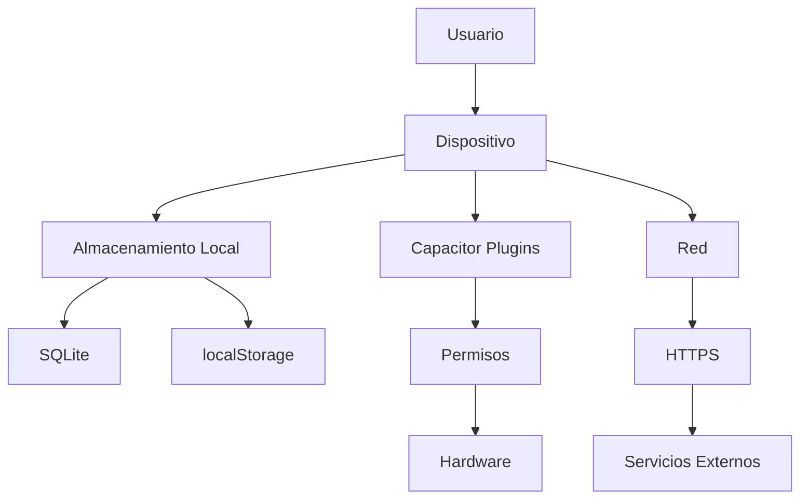
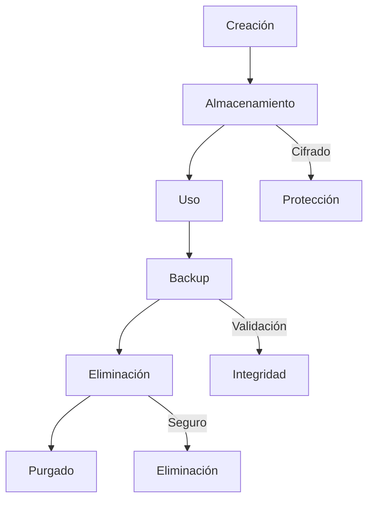
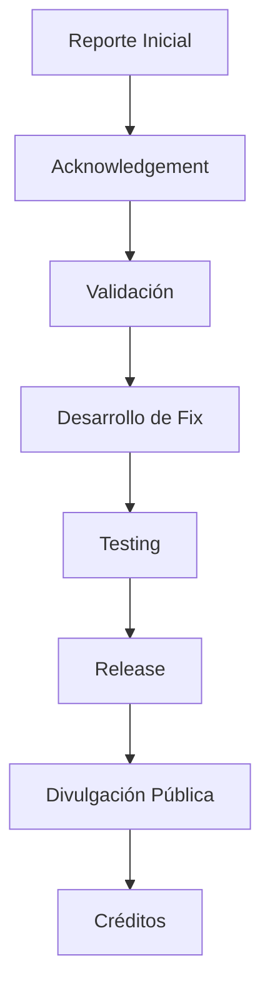

# Seguridad y Privacidad - Daily Journal

## Tabla de Contenidos

- [Visión General](#visión-general)
- [Modelo de Seguridad](#modelo-de-seguridad)
- [Privacidad por Diseño](#privacidad-por-diseño)
- [Medidas de Seguridad Implementadas](#medidas-de-seguridad-implementadas)
- [Manejo de Datos](#manejo-de-datos)
- [Protección de Datos](#protección-de-datos)
- [Vulnerabilidades Conocidas](#vulnerabilidades-conocidas)
- [Política de Divulgación de Vulnerabilidades](#política-de-divulgación-de-vulnerabilidades)
- [Prácticas de Desarrollo Seguro](#prácticas-de-desarrollo-seguro)
- [Seguridad en Producción](#seguridad-en-producción)
- [Auditoría de Seguridad](#auditoría-de-seguridad)
- [Cumplimiento Normativo](#cumplimiento-normativo)
- [Educación en Seguridad](#educación-en-seguridad)
- [Recursos Adicionales](#recursos-adicionales)

## Visión General

Daily Journal está comprometido con la seguridad y privacidad de los datos de los usuarios. Esta documentación describe las medidas de seguridad implementadas, las prácticas de manejo de datos y las políticas de privacidad.

## Modelo de Seguridad

### Principios de Seguridad

1. **Confidencialidad**: Los datos solo son accesibles por el usuario
2. **Integridad**: Los datos no pueden ser modificados sin autorización
3. **Disponibilidad**: Los datos están disponibles cuando el usuario los necesita
4. **Privacidad**: Los datos personales son protegidos

### Arquitectura de Seguridad



## Privacidad por Diseño

### Principios

1. **Minimización de Datos**: Solo se recolectan datos esenciales
2. **Almacenamiento Local**: Todos los datos permanecen en el dispositivo
3. **Transparencia**: El usuario sabe qué datos se almacenan
4. **Control del Usuario**: El usuario tiene control total sobre sus datos
5. **Protección por Defecto**: La privacidad está habilitada por defecto

### Implementación

- **Sin servidores**: No hay backend, todos los datos son locales
- **Sin cuentas**: No se requiere registro o autenticación
- **Sin tracking**: No se recolectan datos de uso
- **Sin analytics**: No se envían datos a servicios de analítica

## Medidas de Seguridad Implementadas

### Protección de Datos

1. **Validación de Entrada**:
   - Sanitización de contenido HTML
   - Limitación de tamaño de entradas
   - Validación de formatos de datos

2. **Protección de Base de Datos**:
   - Consultas parametrizadas para prevenir inyección SQL
   - Validación de esquemas
   - Migraciones seguras

3. **Manejo de Archivos**:
   - Validación de tipos de archivo
   - Limitación de tamaño de archivos
   - Almacenamiento en directorios seguros

4. **Permisos**:
   - Solicitud explícita de permisos
   - Uso mínimo de permisos necesarios
   - Explicación clara de por qué se necesitan permisos

5. **APIs Globales**:
   - Exposición limitada a modo debug
   - Uso de parámetro URL ?debug=true para control
   - Prevención de manipulación por XSS

### Protección de Código

1. **Minificación y Ofuscación**:
   - Builds de producción minificados
   - Eliminación de código muerto
   - Ofuscación de variables sensibles

2. **Protección de Configuración**:
   - Variables de entorno para configuración sensible
   - No almacenar secretos en el código

3. **Actualizaciones Seguras**:
   - Verificación de integridad de actualizaciones
   - Firmado de código para plataformas móviles

## Manejo de Datos

### Tipos de Datos Almacenados

| Tipo de Dato | Descripción | Ejemplo |
|--------------|-------------|---------|
| Entradas de diario | Contenido escrito por el usuario | "Hoy fue un buen día..." |
| Fotos | Imágenes adjuntas a entradas | Data URL de imagen |
| Estado de ánimo | Emoji seleccionado por el usuario | "😊" |
| Configuraciones | Preferencias del usuario | darkMode: true |
| Estadísticas | Datos agregados de uso | totalEntries: 42 |

### Ciclo de Vida de los Datos



### Retención de Datos

- **Datos activos**: Se mantienen mientras el usuario los necesite
- **Backups**: Se recomienda al usuario hacer backups regulares
- **Eliminación**: El usuario puede eliminar datos en cualquier momento

## Protección de Datos

### Medidas de Protección

1. **Almacenamiento Seguro**:
   - Uso de SQLite con acceso controlado
   - Almacenamiento en directorios privados de la app
   - No almacenamiento en almacenamiento externo

2. **Cifrado**:
   - Cifrado en tránsito (HTTPS para PWA)
   - Opción de cifrado local (planeado para futuras versiones)

3. **Backup Seguro**:
   - Exportación a formato estándar (JSON)
   - Validación de integridad de backups
   - Almacenamiento en ubicación seleccionada por el usuario

4. **Eliminación Segura**:
   - Eliminación completa de datos
   - Purgado de cachés
   - Eliminación de archivos temporales

### Buenas Prácticas para Usuarios

1. **Backups Regulares**: Exportar datos periódicamente
2. **Protección del Dispositivo**: Usar código de acceso
3. **Actualizaciones**: Mantener la app actualizada
4. **Permisos**: Revisar permisos concedidos
5. **Eliminación Segura**: Borrar datos antes de vender el dispositivo

## Vulnerabilidades Conocidas

### Vulnerabilidades Actuales

| ID | Descripción | Severidad | Estado | Mitigación |
|----|-------------|-----------|--------|------------|
| SEC-2024-001 | Posible inyección SQL en búsquedas | Media | Fixeado en v1.3.1 | Consultas parametrizadas |
| SEC-2024-002 | XSS en visualización de entradas | Baja | Fixeado en v1.3.1 | Sanitización de HTML |
| SEC-2024-003 | Acceso a archivos del sistema | Media | Fixeado en v1.3.1 | Validación de rutas |

### Vulnerabilidades Históricas

| ID | Descripción | Versión Fix | CVE |
|----|-------------|-------------|-----|
| SEC-2024-001 | Inyección SQL | v1.3.1 | - |
| SEC-2024-002 | XSS | v1.3.1 | - |
| SEC-2024-004 | Exposición de APIs globales inseguras | v1.4.0 | - |

## Política de Divulgación de Vulnerabilidades

### Reportar una Vulnerabilidad

Si descubres una vulnerabilidad de seguridad, por favor:

1. **No la divulges públicamente**
2. **Contacta al equipo de seguridad**: security@dailyjournal.app
3. **Proporciona detalles**:
   - Descripción de la vulnerabilidad
   - Pasos para reproducir
   - Impacto potencial
   - Posible solución (si la tienes)

### Proceso de Divulgación



### Compensación

Actualmente no ofrecemos recompensa monetaria por vulnerabilidades, pero:
- Reconocimiento público (si lo deseas)
- Créditos en el proyecto
- Posibilidad de contribuir al proyecto

## Prácticas de Desarrollo Seguro

### Checklist de Seguridad para Desarrolladores

1. **Validación de Entrada**:
   - Validar todos los inputs de usuario
   - Usar sanitización para contenido HTML
   - Limitar longitud de entradas

2. **Base de Datos**:
   - Usar consultas parametrizadas
   - Validar esquemas
   - Implementar migraciones seguras

3. **Autenticación y Autorización**:
   - No implementar autenticación innecesaria
   - Usar permisos mínimos necesarios

4. **Manejo de Errores**:
   - No exponer información sensible en errores
   - Usar mensajes de error genéricos para usuarios

5. **Logging**:
   - No loguear información sensible
   - Usar logging seguro en producción

6. **Dependencias**:
   - Mantener dependencias actualizadas
   - Revisar dependencias por vulnerabilidades
   - Minimizar el uso de dependencias

### Herramientas de Seguridad

- **ESLint**: Para análisis estático de código
- **Snyk**: Para escaneo de vulnerabilidades en dependencias
- **OWASP ZAP**: Para testing de seguridad
- **Sentry**: Para monitoreo de errores en producción

## Seguridad en Producción

### Configuración de Servidor

1. **Headers de Seguridad**:
   ```nginx
   add_header X-Frame-Options "SAMEORIGIN";
   add_header X-Content-Type-Options "nosniff";
   add_header X-XSS-Protection "1; mode=block";
   add_header Referrer-Policy "strict-origin-when-cross-origin";
   add_header Content-Security-Policy "default-src 'self'; script-src 'self' 'unsafe-inline' 'unsafe-eval';";
   ```

2. **HTTPS**:
   - Certificados SSL válidos
   - HSTS habilitado
   - Redirección automática de HTTP a HTTPS

3. **Protección DDoS**:
   - Limitación de tasa (rate limiting)
   - Protección contra bots
   - Monitoreo de tráfico

### Monitoreo

1. **Logging**:
   - Logs de acceso y errores
   - Monitoreo de actividades sospechosas
   - Alertas para eventos de seguridad

2. **Monitoreo de Performance**:
   - Detección de anomalías
   - Monitoreo de recursos
   - Alertas para degradación de performance

## Auditoría de Seguridad

### Proceso de Auditoría

1. **Análisis Estático**:
   - Revisión de código fuente
   - Escaneo de dependencias
   - Verificación de estándares

2. **Análisis Dinámico**:
   - Testing de penetración
   - Escaneo de vulnerabilidades
   - Pruebas de estrés

3. **Revisión Manual**:
   - Revisión de arquitectura
   - Verificación de flujos críticos
   - Análisis de superficie de ataque

### Frecuencia de Auditorías

| Tipo | Frecuencia |
|------|------------|
| Análisis estático | Cada commit |
| Escaneo de dependencias | Semanal |
| Testing de penetración | Trimestral |
| Auditoría completa | Anual |

## Cumplimiento Normativo

### Estándares Aplicables

1. **GDPR**:
   - Protección de datos personales
   - Derecho al olvido
   - Transparencia en el manejo de datos

2. **CCPA**:
   - Derechos de privacidad de California
   - Acceso y eliminación de datos

3. **ISO 27001**:
   - Sistema de gestión de seguridad de la información

### Implementación

- **Transparencia**: Política de privacidad clara
- **Control del Usuario**: Acceso y eliminación de datos
- **Protección**: Medidas técnicas y organizativas
- **Notificación**: Información sobre brechas de seguridad

## Educación en Seguridad

### Recursos para Desarrolladores

1. **OWASP**:
   - Top 10 vulnerabilidades
   - Guías de desarrollo seguro
   - Herramientas de testing

2. **Cursos**:
   - Seguridad en desarrollo web
   - Seguridad en aplicaciones móviles
   - Criptografía aplicada

3. **Libros**:
   - "Secure by Design"
   - "The Web Application Hacker's Handbook"
   - "Applied Cryptography"

### Buenas Prácticas

1. **Mantenerse Actualizado**:
   - Seguir blogs de seguridad
   - Participar en comunidades
   - Asistir a conferencias

2. **Revisión de Código**:
   - Revisar código de otros
   - Aceptar feedback
   - Aprender de errores

3. **Testing**:
   - Escribir tests de seguridad
   - Automatizar testing
   - Integrar en CI/CD

## Recursos Adicionales

### Documentación de Seguridad

- [OWASP Guide](https://owasp.org/www-project-web-security-testing-guide/)
- [CWE Top 25](https://cwe.mitre.org/top25/)
- [NIST Guidelines](https://csrc.nist.gov/)

### Herramientas

- **Análisis Estático**: SonarQube, ESLint
- **Testing**: OWASP ZAP, Burp Suite
- **Monitoreo**: Sentry, Datadog

### Comunidades

- [OWASP](https://owasp.org/)
- [Security StackExchange](https://security.stackexchange.com/)
- [r/netsec](https://www.reddit.com/r/netsec/)

Esta documentación proporciona una visión completa de las medidas de seguridad y privacidad implementadas en Daily Journal, así como guías para mantener y mejorar la seguridad del proyecto.